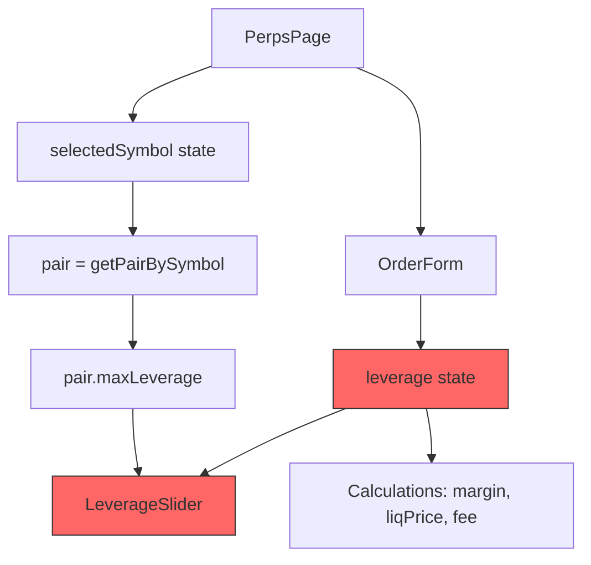

## Problem Statement

When a user sets leverage to 50x on BTC-USD and then switches to G$-USD (max 20x), the leverage state remains at 50x. The leverage text display shows "50x" while the HTML range slider is clamped to 20 by its `max` attribute. This creates a disconnect:

- The React state (`leverage`) stays at 50
- All calculations (margin, liquidation price, notional) use `leverage=50`
- The user sees "50x" in the leverage label
- But the slider appears at the right end (visually suggesting max=20x)

This means a user could unknowingly place an order with 50x leverage on a pair that only supports 20x.

Additionally, the leverage preset buttons use `[1, 2, 5, 10, 25, max]` without filtering values above `max`. For G$-USD (max 20x), this shows a "25x" preset button that exceeds the pair's maximum leverage. For LINK-USD (max 30x), all presets are valid.

The subtitle text "Trade with up to 50x leverage" is also hardcoded and doesn't reflect the selected pair's actual max leverage.

## User Story

As a perpetual futures trader, I want the leverage to automatically clamp to the selected pair's maximum when I switch pairs, so that I don't accidentally use leverage that exceeds the pair's limit and my margin/liquidation calculations are always accurate.

## How It Was Found

Stress-testing the perps trading terminal using agent-browser:
1. Selected BTC-USD, set leverage to 50x
2. Switched to G$-USD (max 20x)
3. Observed leverage display showing "50x" and preset buttons showing [1x, 2x, 5x, 10x, 25x, 20x]
4. The 25x preset exceeds G$-USD's max of 20x

## Proposed UX

- When switching pairs, if current leverage exceeds the new pair's max, clamp it to the new max
- Leverage preset buttons should only include values <= the pair's max leverage
- The subtitle should dynamically reflect the selected pair's max leverage (e.g. "Trade with up to 20x leverage" for G$-USD)
- The presets should be sorted in ascending order

## Acceptance Criteria

- [ ] Switching from a pair with higher maxLeverage to one with lower maxLeverage clamps the leverage value to the new pair's max
- [ ] Leverage preset buttons never show values exceeding the selected pair's maxLeverage
- [ ] Preset buttons are sorted in ascending order
- [ ] Subtitle text dynamically shows the selected pair's max leverage
- [ ] Margin, liquidation price, and all calculations use the correctly clamped leverage
- [ ] No regression in order form behavior for pairs where leverage doesn't need clamping

## Verification

- Run all tests and verify in browser with agent-browser
- Switch between all pairs (BTC 50x, ETH 50x, G$ 20x, SOL 50x, LINK 30x) and verify leverage clamps correctly each time

## Out of Scope

- Adding new leverage validation rules beyond clamping
- Changes to the order book, recent trades, or open positions components
- Backend/contract-level leverage validation

## Overview (Planning)

This is a focused fix to the perps trading terminal's leverage controls in `frontend/src/app/perps/page.tsx`. Three related issues need fixing in two components: `OrderForm` (leverage state management) and `LeverageSlider` (preset generation), plus a minor update to the `PerpsPage` subtitle.

## Research Notes

- The `OrderForm` component uses `useState(10)` for leverage and receives `pair.maxLeverage` through the `LeverageSlider`'s `max` prop
- The `LeverageSlider` uses an HTML range input with `max={max}`, which clamps the slider position but not the React state
- The preset generation `[1, 2, 5, 10, 25, max].filter(unique)` doesn't filter values > max
- Five pairs exist with varying maxLeverage: BTC 50, ETH 50, G$ 20, SOL 50, LINK 30

## Assumptions

- No backend validation exists (mock data only)
- The fix should happen purely on the frontend

## Architecture Diagram

Changes needed (red nodes):
- `F`: Add useEffect to clamp leverage when `pair.maxLeverage` changes
- `G`: Filter presets to only include values <= max, sort ascending

## One-Week Decision

**YES** — This is a small, focused fix touching only `frontend/src/app/perps/page.tsx`. Three changes: (1) add a `useEffect` in `OrderForm` to clamp leverage, (2) fix preset generation in `LeverageSlider`, (3) make subtitle dynamic. Estimated: ~1 hour.

## Implementation Plan

### Phase 1: Fix LeverageSlider presets
- Change `[1, 2, 5, 10, 25, max]` to filter values <= max, then sort ascending

### Phase 2: Clamp leverage on pair change
- In `OrderForm`, add `useEffect` that clamps `leverage` to `pair.maxLeverage` when the pair changes

### Phase 3: Dynamic subtitle
- In `PerpsPage`, change the hardcoded "50x" to use `pair.maxLeverage`

### Phase 4: Tests
- Write tests verifying preset generation, leverage clamping, and subtitle rendering
