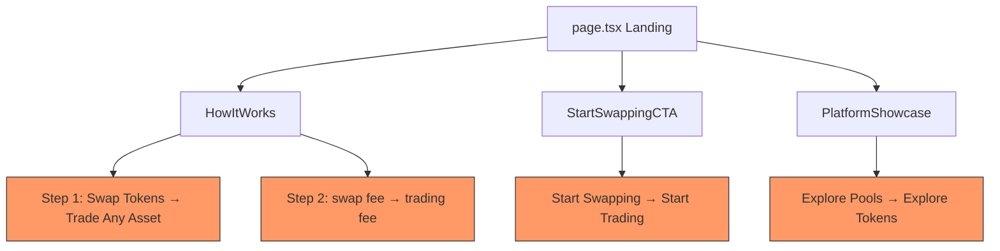

## Problem Statement

The landing page hero was updated to "Trade. Predict. Invest. Fund UBI." and now includes a UBI explainer and platform showcase. However, several remaining text elements are still swap-centric and don't match the broader positioning:

1. **How It Works step 1** says "Swap Tokens" — should cover all platform activities, not just swapping.
2. **How It Works step 2** says "33% of every **swap** fee" — should say "trading fee" or "platform fee" since stocks, perps, and predict also generate fees that fund UBI.
3. **How It Works step 1 description** says "Trade any token on GoodDollar just like you would on any decentralized exchange" — implies it's just a DEX.
4. **"Start Swapping" CTA button** after the platform showcase still says "Start Swapping" — but the user may want to trade stocks, perps, or predict. Should say "Get Started" or "Start Trading".
5. **Platform Showcase GoodSwap card** has CTA text "Explore Pools" linking to `/explore` — but `/explore` shows a token list, not liquidity pools. The CTA text is misleading.

## User Story

As a first-time user who reads the hero "Trade. Predict. Invest. Fund UBI.", I expect the rest of the landing page to maintain that inclusive messaging. When I see "Swap Tokens" and "Start Swapping" below, I'm confused about whether this platform is really about more than swapping.

## How It Was Found

Fresh-eyes review: Read the full landing page top to bottom. The hero and platform showcase communicate a multi-product platform. But the How It Works section and bottom CTA regress to swap-only language, creating a messaging disconnect.

## Proposed UX

1. **How It Works step 1**: Change title from "Swap Tokens" to "Trade Any Asset" and description to "Swap tokens, trade stocks, predict events, or trade perpetual futures — all on one platform."
2. **How It Works step 2**: Change "33% of every swap fee" to "33% of every trading fee"
3. **Start Swapping CTA**: Change text from "Start Swapping" to "Start Trading" (keep scroll-to-swap behavior)
4. **GoodSwap card CTA**: Change "Explore Pools" to "Explore Tokens" since it links to the token list page

## Acceptance Criteria

- [ ] How It Works step 1 title reads "Trade Any Asset" (not "Swap Tokens")
- [ ] How It Works step 1 description mentions multiple product types, not just swapping
- [ ] How It Works step 2 description says "trading fee" not "swap fee"
- [ ] Bottom CTA button says "Start Trading" (not "Start Swapping")
- [ ] GoodSwap platform showcase card CTA says "Explore Tokens" (not "Explore Pools")
- [ ] All existing tests pass (update any tests referencing old copy)
- [ ] No regressions in layout

## Verification

- Run all tests and verify in browser with agent-browser
- Read the full landing page and verify messaging consistency

## Out of Scope

- Redesigning the How It Works section layout
- Changing the swap card behavior
- Adding new sections to the landing page
- Changing the UBI Explainer or Stats sections

## Overview (Planning)

This is a text-only change touching 3 files: `HowItWorks.tsx`, `StartSwappingCTA.tsx`, and `PlatformShowcase.tsx`. No structural or layout changes — just updating copy to be consistent with the multi-product platform positioning.

## Research Notes

- `frontend/src/components/HowItWorks.tsx`: Contains a `steps` array with 3 entries. Step 1 title="Swap Tokens", Step 2 description mentions "swap fee"
- `frontend/src/components/StartSwappingCTA.tsx`: Button text is "Start Swapping"
- `frontend/src/components/PlatformShowcase.tsx` (server component in `.next/server/chunks/9238.js`): GoodSwap card has CTA "Explore Pools"
- Tests in `frontend/src/components/__tests__/HowItWorks.test.tsx` reference "Swap Tokens" text — need to update

## Assumptions

- No structural changes needed — pure copy updates
- The scroll-to-swap behavior of the CTA is fine to keep (just rename the button)

## Architecture Diagram

## One-Week Decision

**YES** — This is a ~30 minute task. Pure copy changes in 3 component files plus updating corresponding test files.

## Implementation Plan

### Phase 1: Update HowItWorks.tsx
- Step 1 title: "Swap Tokens" → "Trade Any Asset"
- Step 1 description: Broaden to mention multiple product types
- Step 2 description: "swap fee" → "trading fee"

### Phase 2: Update StartSwappingCTA.tsx
- Button text: "Start Swapping" → "Start Trading"

### Phase 3: Update PlatformShowcase.tsx
- GoodSwap card CTA: "Explore Pools" → "Explore Tokens"

### Phase 4: Update tests
- Fix any test assertions referencing old copy strings
