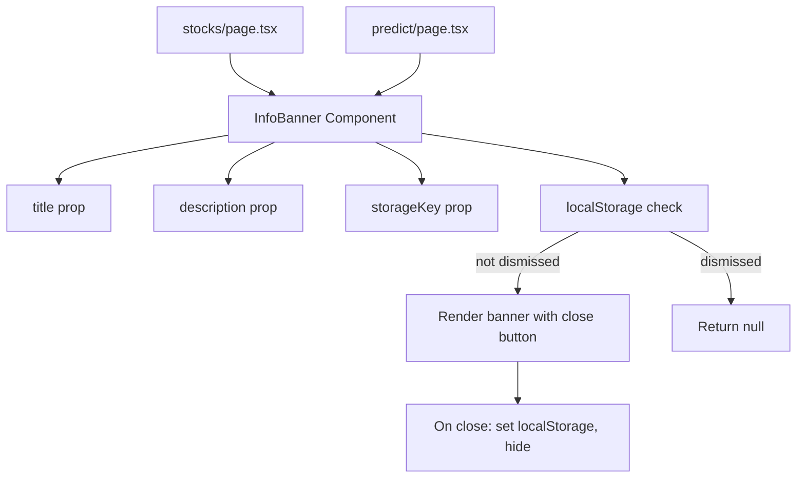

## Problem Statement

When a first-time user navigates to the Stocks or Predict sections, the page headers are brief subtitles ("Trade synthetic equities 24/7 with fractional shares. Every trade funds UBI." and "Bet on real-world events. Every trade funds UBI.") but don't explain key concepts that a newcomer would need:

- **Stocks page**: "Synthetic equities" and "fractional shares" are DeFi jargon. A user from traditional finance doesn't know what a "synthetic" stock is or how it differs from a real stock. There's no mention of how prices are tracked (oracle-based) or the 24/7 trading benefit.
- **Predict page**: Prediction market pricing (shares at cents, e.g. "48¢") is unfamiliar to most users. There's no explanation of how buying YES/NO shares works or how you profit.

The Perps page at least has clear trading terminology that matches existing crypto UX patterns. But Stocks and Predict are newer concepts that need more onboarding context.

## User Story

As a first-time user who clicks "Stocks" or "Predict", I want a brief explanation of how the product works so I can understand what I'm looking at and feel confident placing a trade.

## How It Was Found

Fresh-eyes review: Navigated to the Stocks page. Saw familiar tickers (MSFT, AAPL) but was unsure how "synthetic" stock trading works. Is it tied to real stock prices? Can I hold overnight? What about dividends? Similarly, on the Predict page, the probability percentages and cent-based pricing assumed I knew how prediction markets work.

## Proposed UX

Add a dismissible "info banner" at the top of the Stocks and Predict section pages (below the section header, above the content):

**Stocks info banner:**
> **How Tokenized Stocks Work** — Synthetic stock tokens track real equity prices via Chainlink oracles. Trade 24/7 with fractional amounts starting at $1. Every trade routes 33% of fees to UBI. [Dismiss]

**Predict info banner:**
> **How Prediction Markets Work** — Buy YES or NO shares on any event. If you're right, each share pays $1. If wrong, you lose your stake. Share prices (5¢–95¢) reflect the crowd's probability estimate. [Dismiss]

Banners should:
- Have a teal-tinted background matching the theme
- Include a close/dismiss button that persists via localStorage
- Be compact (1-2 lines on desktop, wrapping on mobile)
- Not appear again once dismissed

## Acceptance Criteria

- [ ] Stocks page shows an info banner below the section header explaining synthetic stock trading
- [ ] Predict page shows an info banner below the section header explaining prediction market mechanics
- [ ] Each banner has a dismiss/close button
- [ ] Dismissal persists via localStorage (banner doesn't reappear after page reload)
- [ ] Banners are responsive and readable on mobile
- [ ] Banners match the dark theme design language
- [ ] All existing tests pass

## Verification

- Run all tests and verify in browser with agent-browser
- Dismiss banners and reload — they should stay dismissed
- Check both desktop and mobile layouts

## Out of Scope

- Adding info banners to Perps (standard crypto trading UX)
- Adding banners to Pool/Bridge (Coming Soon pages)
- Tutorials, tooltips, or multi-step onboarding flows
- Changing existing page layouts or data

## Overview (Planning)

Create a reusable `InfoBanner` component that accepts a title, description, and localStorage key for dismissal. Use this component on the Stocks (`/stocks`) and Predict (`/predict`) pages to show brief explainers for first-time users.

## Research Notes

- Stocks page: `frontend/src/app/stocks/page.tsx` — client component with section header and table
- Predict page: `frontend/src/app/predict/page.tsx` — client component with market cards grid
- Both pages already use `useState` so adding localStorage-based dismissal is straightforward
- The `SectionNav` component handles the tabs (Markets/Portfolio) — the banner should go below the section header, above the content

## Assumptions

- localStorage key pattern: `gd-banner-dismissed-{section}` (e.g. `gd-banner-dismissed-stocks`)
- Banner design matches existing card/border style with a subtle info tone
- One banner per section page (not per tab)

## Architecture Diagram

## One-Week Decision

**YES** — This is a ~1 hour task. Create one reusable component, add it to 2 pages, write tests.

## Implementation Plan

### Phase 1: Create InfoBanner component
- Create `frontend/src/components/InfoBanner.tsx`
- Props: `title`, `description`, `storageKey`
- Uses `useState` + `useEffect` to check localStorage on mount
- Renders a teal-tinted info bar with close button
- On dismiss: writes to localStorage, hides via state

### Phase 2: Add to Stocks page
- Import InfoBanner in `stocks/page.tsx`
- Place below the section header with stock-specific copy

### Phase 3: Add to Predict page
- Import InfoBanner in `predict/page.tsx`
- Place below the section header with prediction-market-specific copy

### Phase 4: Tests
- Write tests for InfoBanner component (render, dismiss, localStorage persistence)
