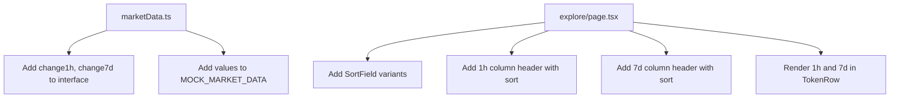

## Problem Statement

CoinGecko's token table shows three timeframe price change columns: 1h, 24h, and 7d. Our Explore page only shows a single "24h Change" column. This limits the data richness for traders who need to compare short-term momentum (1h) against medium-term trends (7d). A user scanning our table can't distinguish between a token that spiked in the last hour vs. one that has been steadily climbing all week — both might show the same 24h figure.

## User Story

As a DeFi trader on the Explore page, I want to see 1h and 7d price changes alongside the 24h column so that I can quickly assess both short-term momentum and weekly trends for each token.

## How It Was Found

Side-by-side competitor comparison: CoinGecko's table has three change columns (1h, 24h, 7d) with green/red coloring and arrow indicators. Our table has only "24h Change". The additional timeframes give CoinGecko users significantly more signal about each token's trajectory.

## Proposed UX

- Add a "1h" change column between "Price" and the current "24h Change" column
- Add a "7d" change column after "24h Change"
- All three columns use the same green/red formatting with up/down arrows
- On mobile, show only 24h change (hide 1h and 7d below `sm` breakpoint)
- All three columns are sortable
- Generate synthetic 1h and 7d change data in the market data utility

Column order: # | Token | Price | 1h | 24h | 7d | Volume | Market Cap | [Sparkline] | [Swap]

## Acceptance Criteria

- [ ] A "1h" change column appears between Price and 24h Change
- [ ] A "7d" change column appears after 24h Change
- [ ] Both columns use green/red coloring with triangle arrows
- [ ] Both columns are sortable (clicking header toggles sort)
- [ ] 1h and 7d columns are hidden on mobile (below `sm` breakpoint)
- [ ] Market data utility provides `change1h` and `change7d` fields
- [ ] All existing tests pass (update if they check column count)

## Verification

- Run all tests and verify in browser with agent-browser
- Sort by 1h and 7d columns — verify sorting works
- Check mobile layout — only 24h should show

## Out of Scope

- Real-time price change data from APIs
- Additional timeframes (30d, 1y)
- Click-through to detailed charts

## Overview (Planning)

Add `change1h` and `change7d` fields to the `TokenMarketData` interface and `MOCK_MARKET_DATA`, then add two new sortable columns to the Explore table between Price and the existing 24h Change column.

## Research Notes

- `frontend/src/lib/marketData.ts`: `MOCK_MARKET_DATA` has `change24h`. Need to add `change1h` and `change7d` as new fields.
- `frontend/src/app/explore/page.tsx`: `SortField` type is `'price' | 'change24h' | 'volume24h' | 'marketCap'`. Need to add `'change1h' | 'change7d'`.
- The table header uses `handleSort()` for click-to-sort. Same pattern for new columns.
- CoinGecko column order: # | Coin | Price | 1h | 24h | 7d | Volume | Market Cap | Last 7 Days

## Assumptions

- Synthetic 1h and 7d change values for each token (small random-ish but deterministic numbers)
- Column headers: "1h" and "7d" (matching CoinGecko's compact labels)

## Architecture Diagram

## One-Week Decision

**YES** — This is a ~1 hour task. Add data fields and two table columns.

## Implementation Plan

### Phase 1: Update market data
- Add `change1h` and `change7d` to `TokenMarketData` interface
- Add synthetic values to each entry in `MOCK_MARKET_DATA`

### Phase 2: Update Explore page
- Add `'change1h' | 'change7d'` to `SortField` type
- Add "1h" column header between Price and 24h Change
- Add "7d" column header after 24h Change
- Render change values in `TokenRow` with green/red formatting
- Hide both on mobile

### Phase 3: Tests
- Update any tests that check column count or table structure
