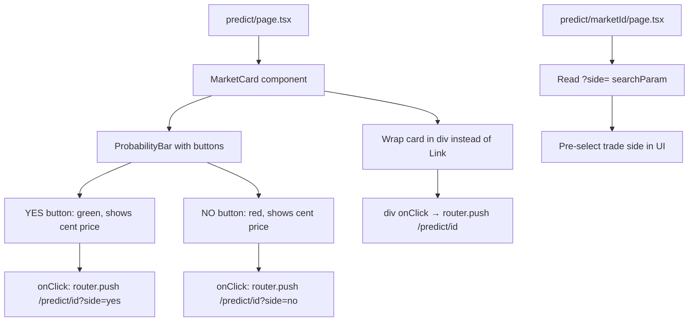

## Problem Statement

On Polymarket, users can click "Yes" or "No" buttons directly from the market listing to immediately buy shares — no page navigation needed. Our Predict market cards are entirely wrapped in a link to the detail page. There are no inline trade buttons, so every trade requires: browse → click card → navigate to detail → find buy form → trade. This is 2-3 extra clicks compared to Polymarket for a returning user who already knows what they want to bet on.

The probability bar at the bottom of our cards shows YES/NO cent prices but they're not actionable — just text. Polymarket makes these clickable.

## User Story

As a prediction market user browsing the markets list, I want to click YES or NO directly from a market card so that I can quickly take positions without navigating to the detail page every time.

## How It Was Found

Side-by-side competitor comparison with Polymarket: Every market on Polymarket's home page has inline "Yes [price]" and "No [price]" buttons. Clicking them opens a trade panel. Our cards have the probability bar with prices shown as text but no interactive trade buttons. A Polymarket power user would find our browse-only card experience slow and frustrating.

## Proposed UX

Replace the existing non-interactive cent prices next to the probability bar with two small clickable buttons:
- **YES button**: Green-tinted, shows the YES cent price (e.g., "Yes 48¢")
- **NO button**: Red-tinted, shows the NO cent price (e.g., "No 52¢")
- Clicking either button navigates to `/predict/{marketId}?side=yes` or `?side=no` (the detail page can pre-select the trade side)
- The entire card should still be clickable to navigate to the detail page, but the buttons should have `stopPropagation` to prevent double navigation
- Buttons should have a hover state that makes them more prominent
- On expired markets, buttons should be disabled/hidden

## Acceptance Criteria

- [ ] Each active market card shows YES and NO buttons with cent prices
- [ ] YES button has a green-tinted style, NO button has a red-tinted style
- [ ] Clicking YES navigates to `/predict/{marketId}?side=yes`
- [ ] Clicking NO navigates to `/predict/{marketId}?side=no`
- [ ] Buttons don't trigger the card's Link navigation (stopPropagation)
- [ ] Expired market cards don't show trade buttons (or show them disabled)
- [ ] Buttons have visible hover states
- [ ] Card still navigates to detail page when clicking non-button areas
- [ ] All existing tests pass

## Verification

- Run all tests and verify in browser with agent-browser
- Click YES button — verify navigation to detail page with `?side=yes`
- Click card body — verify it still navigates to detail page without query param
- Check expired markets have no active buttons

## Out of Scope

- Inline trade execution (no wallet/transaction from the card itself)
- Inline order amount input
- Multi-outcome market support
- Trade panel modal/popover

## Overview (Planning)

Replace the static cent-price text next to the probability bar in `MarketCard` with two clickable buttons (YES/NO) that navigate to the detail page with a `side` query parameter. The detail page at `/predict/[marketId]/page.tsx` can read the query param to pre-select the trade side.

## Research Notes

- `frontend/src/app/predict/page.tsx`: `MarketCard` component wraps in a `<Link>` to `/predict/${market.id}`. The probability bar shows `{yesPct}¢` and `{noPct}¢` as plain text spans.
- `frontend/src/app/predict/[marketId]/page.tsx`: Detail page needs to check for `?side=yes|no` query param and pre-select the corresponding trade side.
- The `ProbabilityBar` component is defined in the predict page file, not as a shared component.
- To add clickable buttons inside a `<Link>`, the buttons need `onClick` with `e.preventDefault()` and `e.stopPropagation()` to prevent the link navigation, then use `router.push()` instead.
- Alternative: Change the card from a `<Link>` to a `
` with an `onClick` handler for the main navigation, and use separate `<Link>` elements for the buttons.
- The `getMarketStatus` function returns 'expired' for past markets — use this to conditionally hide buttons.

## Assumptions

- The YES/NO buttons replace the existing text cent prices in the ProbabilityBar area
- Buttons navigate to `/predict/{id}?side=yes` or `?side=no`
- The detail page will use the query param to pre-select trade side (basic implementation)

## Architecture Diagram

## One-Week Decision

**YES** — This is a ~2 hour task. Modify the MarketCard component and update the detail page to read a query param.

## Implementation Plan

### Phase 1: Update MarketCard
- Change the card wrapper from `<Link>` to a `
` with `onClick` for main navigation
- Replace the static cent prices with YES/NO button elements
- YES button: green bg/text, shows "Yes {price}¢", navigates to `?side=yes`
- NO button: red bg/text, shows "No {price}¢", navigates to `?side=no`
- Use `e.stopPropagation()` on button clicks
- Hide/disable buttons on expired markets

### Phase 2: Update detail page
- Read `searchParams.side` in the detail page
- Pre-select the trade side based on the query parameter

### Phase 3: Tests
- Test that clicking YES/NO buttons navigates correctly
- Test that expired market cards don't have active buttons
