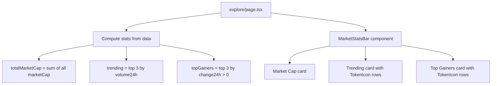

## Problem Statement

CoinGecko's page opens with a prominent market overview section showing total market cap (with 24h change), 24h trading volume (with a sparkline), trending coins, and top gainers. This gives users immediate context about overall market conditions before they scan individual tokens. Our Explore page has only a title ("Explore Tokens") and subtitle with no aggregate market data. A user has to mentally piece together market conditions from individual rows instead of getting an at-a-glance overview.

## User Story

As a DeFi user visiting the Explore page, I want to see an overview of total market cap, 24h trading volume, and trending/top-gaining tokens so that I can quickly understand overall market conditions before diving into individual tokens.

## How It Was Found

Side-by-side competitor comparison with CoinGecko: CoinGecko shows three highlight cards above the token table — Total Market Cap (with a mini sparkline and 24h change), Trending coins (top 3), and Top Gainers (top 3). Our page has a text heading and a search box, then jumps straight to the table. The information density above the fold is significantly lower than CoinGecko.

## Proposed UX

Add a 3-card stats row between the page title and the search box:

1. **Total Market Cap** card: Shows the sum of all listed tokens' market caps, formatted as "$X.XX T". Includes 24h change percentage.
2. **Trending** card: Shows the top 3 tokens by 24h volume with their price and change. Label with a fire icon.
3. **Top Gainers** card: Shows the top 3 tokens by 24h positive change with their symbol, price, and change percentage. Label with a rocket icon.

Cards should:
- Use the existing dark card style (bg-dark-100, rounded-2xl, border)
- Be responsive: 3 columns on desktop, stack vertically on mobile
- Be compact — each card ~120px tall
- Compute data from the existing token market data (no new API calls)

## Acceptance Criteria

- [ ] Three stats cards appear above the search box on the Explore page
- [ ] Market Cap card shows total market cap and 24h change
- [ ] Trending card shows top 3 tokens by volume
- [ ] Top Gainers card shows top 3 tokens by positive 24h change
- [ ] Cards are responsive (3-column on desktop, 1-column on mobile)
- [ ] Data is computed from existing `getTokenMarketData()` function
- [ ] Cards match the existing dark theme design
- [ ] All existing tests pass

## Verification

- Run all tests and verify in browser with agent-browser
- Check desktop and mobile layouts
- Verify data accuracy (market cap total, correct top 3 gainers/trending)

## Out of Scope

- Real-time data updates
- BTC/ETH dominance percentage
- Gas price indicator
- Sparkline charts in the stats cards
- Click-through on trending/gainers to filter the table

## Overview (Planning)

Add a 3-card stats row to the Explore page between the title and search box. Compute total market cap, trending (top 3 by volume), and top gainers (top 3 by positive 24h change) from the existing `getTokenMarketData()` function.

## Research Notes

- `frontend/src/app/explore/page.tsx`: Uses `getTokenMarketData()` which returns all tokens sorted by market cap
- `frontend/src/lib/marketData.ts`: `formatVolume` function can be reused for the market cap total
- CoinGecko's highlight cards use white background with colored accents, but our dark theme should use `bg-dark-100` cards
- The stats are purely computed from existing data, no new API calls needed

## Assumptions

- Total market cap is the sum of all tokens' `marketCap` values
- 24h change for total market cap: weighted average of individual 24h changes by market cap
- Trending = top 3 by `volume24h`
- Top Gainers = top 3 by highest positive `change24h`

## Architecture Diagram

## One-Week Decision

**YES** — This is a ~2 hour task. One new component section in the explore page with computed data.

## Implementation Plan

### Phase 1: Compute stats
- In the Explore page, compute totalMarketCap, trending, and topGainers from the token data
- Use `useMemo` for efficient computation

### Phase 2: Create stats cards section
- Add a 3-column grid of cards above the search box
- Card 1: Market Cap total + weighted 24h change
- Card 2: Trending (top 3 tokens by volume, show icon + symbol + price + change)
- Card 3: Top Gainers (top 3 by positive change, show icon + symbol + price + change)
- Style with `bg-dark-100 rounded-2xl border border-gray-700/20`
- Responsive: 3 cols on md+, 1 col on mobile

### Phase 3: Tests
- Test that stats are computed correctly
- Test responsive layout
