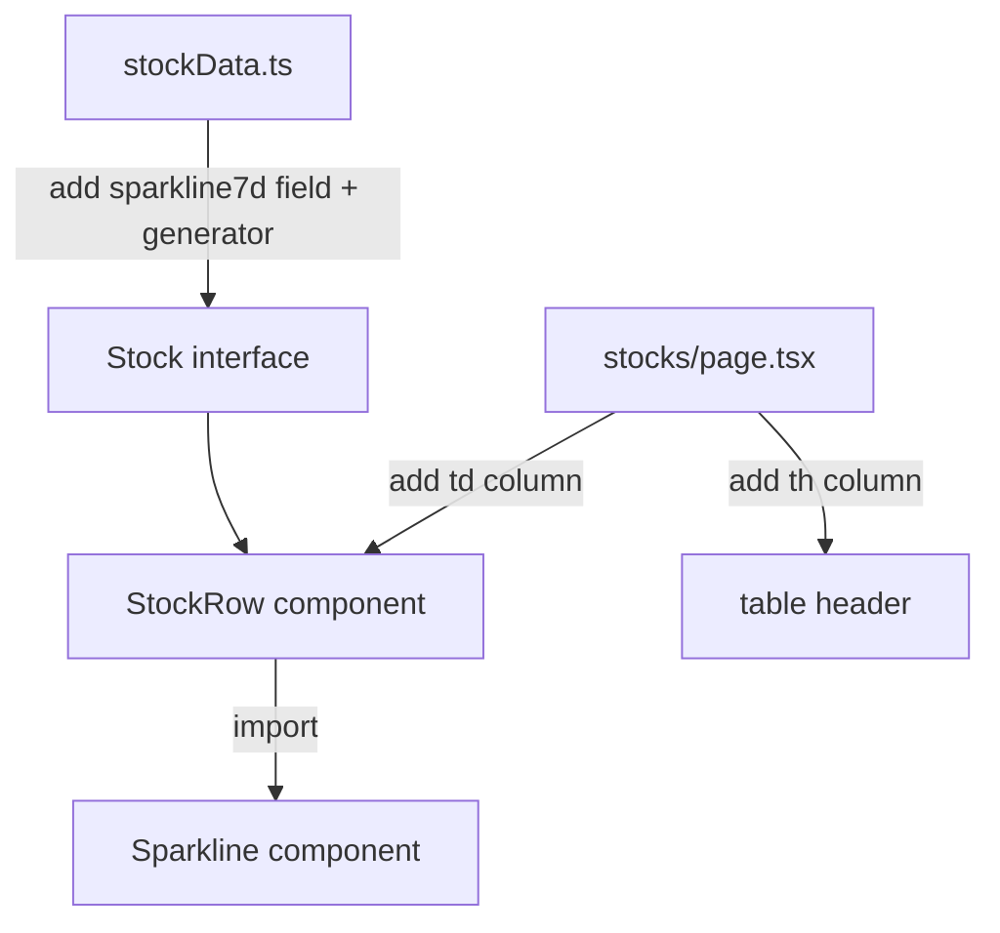

## Problem Statement

The Explore page token table includes 7-day sparkline charts in each row, giving users an at-a-glance view of price trends. The Stocks page table, which is a very similar asset-listing UI, lacks sparklines entirely. This inconsistency makes the Stocks section feel less data-rich and polished than Explore.

## User Story

As a user browsing tokenized stocks, I want to see a mini price chart next to each stock so I can quickly assess its recent trend without clicking into the detail page.

## How It Was Found

During a surface sweep review comparing all pages. The Explore page (`/explore`) has sparkline charts rendered via the `Sparkline` component in each table row. The Stocks page (`/stocks`) only shows Price, 24h Change, Volume, and Market Cap — no visual trend indicator.

## Proposed UX

- Add a 7-day sparkline chart column to the stocks table, matching the explore table's design.
- Use the existing `Sparkline` component.
- Generate mock sparkline data in `stockData.ts` (same approach as `marketData.ts`).
- The sparkline column should be hidden on smaller screens (`hidden lg:table-cell`) to maintain mobile responsiveness.
- Color the sparkline green when 24h change is positive, red when negative — matching explore behavior.

## Acceptance Criteria

- [ ] Each stock row in `/stocks` displays a 7-day sparkline chart.
- [ ] Sparkline uses the existing `Sparkline` component from `@/components/Sparkline`.
- [ ] Sparkline is green for positive 24h change, red for negative.
- [ ] Sparkline column is hidden on screens smaller than `lg` breakpoint.
- [ ] Stock data model includes `sparkline7d: number[]` field.
- [ ] All existing tests continue to pass.
- [ ] Visual appearance matches the explore page sparklines.

## Verification

- Run full test suite: `npx vitest run`
- Verify in browser that sparkline charts appear in the stocks table.
- Compare visual consistency with the explore page sparklines.

## Overview

Add sparkline charts to the Stocks table to match the Explore page's data-rich presentation.

## Research Notes

- The `Sparkline` component at `frontend/src/components/Sparkline.tsx` already renders SVG sparklines. It accepts `data: number[]`, `positive: boolean`, and optional `width`/`height`.
- The Explore page generates sparkline data via `generateSparkline()` in `frontend/src/lib/marketData.ts`, using a seeded random function for deterministic output.
- The Stock data model at `frontend/src/lib/stockData.ts` has `Stock` interface but no `sparkline7d` field.
- The stocks table at `frontend/src/app/stocks/page.tsx` uses the same column pattern as explore but lacks the sparkline column.

## Architecture

## One-Week Decision

**YES** — This is a straightforward data model extension + UI column addition. Estimated effort: 1-2 hours.

## Implementation Plan

1. Add `sparkline7d: number[]` to the `Stock` interface in `stockData.ts`.
2. Copy the `generateSparkline()` helper (or a similar one) to `stockData.ts`.
3. Generate sparkline data for each mock stock entry.
4. Import the `Sparkline` component in `stocks/page.tsx`.
5. Add a sparkline column header (hidden `lg:table-cell`).
6. Render `<Sparkline>` in each `StockRow`.
7. Update the empty-state `colSpan` to account for the new column.

## Out of Scope

- Adding 1h or 7d change columns to the stocks table (that can be a separate initiative).
- Real-time stock price data.
- Interactive sparkline hover behavior.
