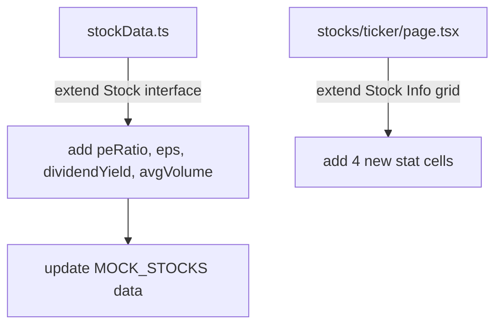

## Problem Statement

The stock detail page (`/stocks/[ticker]`) shows a price chart and a buy/sell form, but lacks fundamental stock metrics that users expect when evaluating a stock. Key data points like market cap, P/E ratio, 52-week range, and dividend yield are missing. Platforms like Robinhood and Yahoo Finance prominently display these metrics on their stock detail pages.

## User Story

As a user viewing a stock detail page, I want to see key fundamental metrics (market cap, P/E, 52-week range, EPS, dividend yield) so I can make informed trading decisions without leaving the page.

## How It Was Found

During a surface sweep review of the stock detail page `/stocks/AAPL`. The page shows a chart and trading form but no fundamental data. Competitor platforms show key statistics prominently alongside the chart.

## Proposed UX

- Add a "Key Statistics" or "Fundamentals" panel below the chart and above the "Your Position" section.
- Display in a 2-column or 3-column grid of stat cards:
  - Market Cap
  - P/E Ratio
  - EPS (Earnings Per Share)
  - Dividend Yield
  - 52-Week High / Low
  - Average Volume
- Use the same card styling as the perps portfolio stats cards (bg-dark-100, rounded-xl, border).
- Generate mock data in `stockData.ts` for each stock.
- Stats labels in gray-400, values in white, with green/red coloring for relevant metrics.

## Acceptance Criteria

- [ ] Stock detail page shows a "Key Statistics" panel with at least 6 metrics.
- [ ] Metrics include: Market Cap, P/E Ratio, EPS, Dividend Yield, 52-Week High/Low, Avg Volume.
- [ ] Stock data model includes fields for all displayed metrics.
- [ ] Panel uses consistent styling with the rest of the app (dark theme, rounded cards).
- [ ] Panel is responsive — 3 columns on desktop, 2 on tablet, 1 on mobile.
- [ ] All existing tests continue to pass.

## Verification

- Run full test suite: `npx vitest run`
- Verify in browser at `/stocks/AAPL` that the key metrics panel appears.
- Check responsive layout on mobile viewport.

## Overview

Enrich the stock detail page with fundamental metrics. The page already has a "Stock Info" section with 6 basic fields (Market Cap, 24h Volume, Sector, 52W High, 52W Low, 24h Change). This initiative adds additional financial metrics: P/E Ratio, EPS, Dividend Yield, and Average Volume.

## Research Notes

- Stock detail page at `frontend/src/app/stocks/[ticker]/page.tsx` already has a "Stock Info" panel with a 2x3 grid.
- The `Stock` interface in `stockData.ts` has: ticker, name, sector, price, change24h, volume24h, marketCap, high52w, low52w.
- Need to add: `peRatio`, `eps`, `dividendYield`, `avgVolume` to the interface and mock data.
- The existing "Stock Info" section can be extended rather than creating a new panel.

## Architecture

## One-Week Decision

**YES** — Simple data model extension and grid expansion. Estimated effort: 1 hour.

## Implementation Plan

1. Add `peRatio`, `eps`, `dividendYield`, `avgVolume` fields to the `Stock` interface.
2. Add realistic mock values for each stock in `MOCK_STOCKS`.
3. Extend the "Stock Info" grid in the detail page to include the 4 new metrics.
4. Format dividend yield as percentage, P/E and EPS as numbers.
5. Color P/E and EPS appropriately (green for positive EPS, etc.).

## Out of Scope

- Real financial data integration.
- Historical metrics or charts for individual metrics.
- Analyst ratings or price targets.
