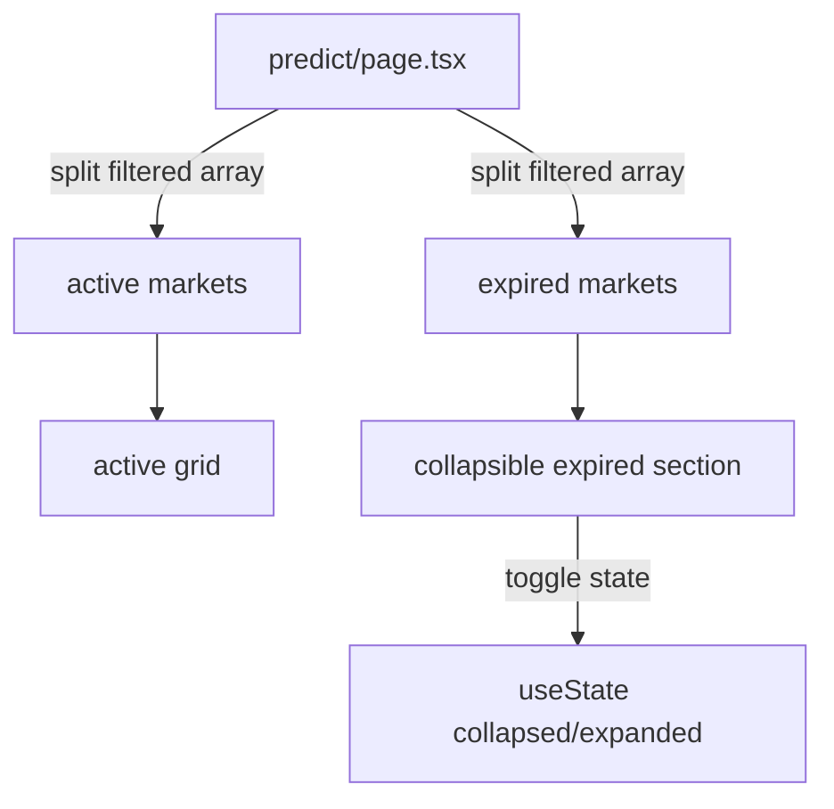

## Problem Statement

The Predict page sorts expired markets below active ones, but there is no visual separator or section heading between the two groups. With 3 active markets and 11 expired ones, users have to look at each card's "Expired" badge to understand which markets they can still trade on. A clear divider between active and expired sections would make the page easier to scan.

## User Story

As a user browsing prediction markets, I want to clearly see which markets are active (tradeable) vs expired so I can focus my attention on markets I can participate in.

## How It Was Found

During a surface sweep review of the Predict page (`/predict`). Active markets (3) have YES/NO trade buttons and a green probability bar. Expired markets (11) show an "Expired" badge and no trade buttons. But both groups flow in the same grid with no visual break, making it easy to miss the transition.

## Proposed UX

- Add a section heading "Expired Markets" with a subtle divider line before the expired markets group.
- Use a lighter opacity or slightly different card styling for expired market cards (e.g., `opacity-60` or a dimmed border).
- Optionally add an active markets count label: "3 Active Markets" at the top.
- The expired section should be collapsible with a toggle: "Show expired (11)" / "Hide expired" — defaulting to collapsed on first visit.
- Category filters should still work across both sections.

## Acceptance Criteria

- [ ] A visible section heading "Expired Markets" appears between active and expired market cards.
- [ ] Expired section is collapsible with a toggle button, defaulting to collapsed.
- [ ] Toggle shows count of expired markets: "Show expired (N)".
- [ ] Expired cards have reduced visual emphasis (opacity or dimmed styling).
- [ ] Category filters and search still filter across both active and expired markets.
- [ ] All existing tests continue to pass.

## Verification

- Run full test suite: `npx vitest run`
- Verify in browser at `/predict` that the separator and collapse toggle appear.
- Test that expanding/collapsing works correctly.
- Test that category filters affect both sections.

## Overview

Add clear visual separation between active and expired prediction markets on the Predict page.

## Research Notes

- The Predict page at `frontend/src/app/predict/page.tsx` renders all markets in a single grid.
- Market expired state is determined by `getMarketStatus()` from `predictData.ts` which checks the `endDate`.
- The `MarketCard` component already dims expired cards with `opacity-60` and hides YES/NO buttons.
- `filterAndSortMarkets()` in `predictData.ts` sorts expired markets after active ones.
- Currently 3 active markets and 11 expired ones in mock data.

## Architecture

## One-Week Decision

**YES** — UI-only change splitting an array and adding a collapsible section. Estimated effort: 1-2 hours.

## Implementation Plan

1. In the PredictPage component, split `filtered` markets into `activeMarkets` and `expiredMarkets` arrays.
2. Render active markets grid first.
3. Add a separator with heading "Expired Markets (N)" and a toggle button.
4. Use `useState` for collapsed/expanded state (default: collapsed).
5. When expanded, render expired markets in the same grid style.
6. Apply slightly dimmed styling to the expired section heading.
7. Ensure category filters and search still work across both groups.

## Out of Scope

- Removing expired markets entirely.
- Adding pagination or infinite scroll.
- Market resolution status display.
