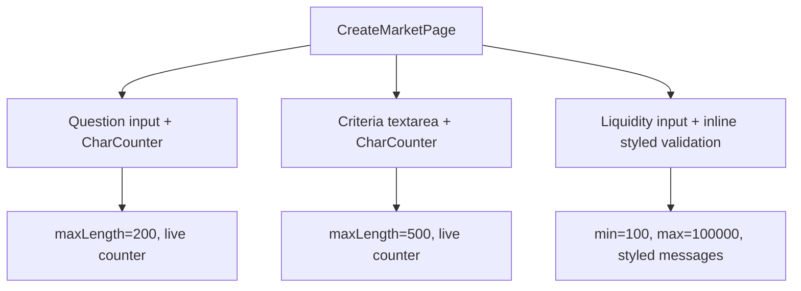

## Problem Statement

The Create Market form at `/predict/create` accepts unlimited-length text in the Question and Resolution Criteria fields with no character counter or upper bound. A user could paste a multi-paragraph question that would break the market card layout on the listing page. The Initial Liquidity field accepts any number via the browser's native `<input type="number">` validation (showing "Value must be greater than or equal to 100") but has no upper limit and no visual feedback about constraints until form submission is attempted.

Compared to Polymarket, which shows character limits and inline constraints, the form feels unpolished and could lead to poor-quality markets.

## User Story

As a market creator, I want clear input constraints and real-time feedback (character counters, inline validation) so I can craft a well-formed market question without guessing the limits.

## How It Was Found

During error-handling testing of the Create Market form at `/predict/create`. Submitted the form with empty fields — proper validation appeared. But then tested with no constraints: the Question field accepts unlimited text, Resolution field has no character limit, and the Initial Liquidity field shows browser-native tooltip validation instead of styled inline feedback.

## Proposed UX

- Question field: max 200 characters with a live counter (e.g., "42/200").
- Resolution Criteria field: max 500 characters with a live counter.
- Initial Liquidity field: styled inline validation message (matching the red error text style of other fields) instead of relying on browser-native tooltip. Show the minimum prominently.
- Add an upper limit hint for liquidity (e.g., "Min $100 · Max $100,000").
- All validation messages should use the same styled red text pattern as the existing "Question is required" messages.

## Acceptance Criteria

- [ ] Question field has a `maxLength` of 200 with a live character counter visible below the input.
- [ ] Resolution Criteria field has a `maxLength` of 500 with a live character counter.
- [ ] Character counters turn amber at 80% capacity and red at 100%.
- [ ] Initial Liquidity shows styled inline validation for below-minimum values (not browser-native tooltip).
- [ ] Initial Liquidity shows max limit hint.
- [ ] All existing tests continue to pass.
- [ ] New tests verify character limit enforcement and counter rendering.

## Verification

- Run full test suite: `npx vitest run`
- Verify in browser at `/predict/create`: type a long question and see the counter.
- Verify liquidity validation appears as styled text, not a browser tooltip.

## Overview

Add character limits, live counters, and styled inline validation to the Create Market form to improve input quality and error feedback.

## Research Notes

- The Create Market form is at `frontend/src/app/predict/create/page.tsx` — a single client component.
- Current validation is on-submit only via `validate()` function. No real-time feedback.
- Uses controlled inputs with `useState` for `question`, `criteria`, `liquidity`.
- The `<input type="number" min="100">` relies on browser-native validation tooltip.
- Polymarket uses 100-200 char limits for questions with visible counters.

## Architecture

## One-Week Decision

**YES** — Single file edit adding `maxLength` attributes, a small `CharCounter` sub-component, and replacing browser-native validation with styled inline messages. Estimated effort: 1-2 hours.

## Implementation Plan

1. Add a `CharCounter` inline component that accepts `current` and `max` props, renders "current/max" text, and changes color at 80% (amber) and 100% (red).
2. Add `maxLength={200}` to the Question input and render `CharCounter` below it.
3. Add `maxLength={500}` to the Resolution Criteria textarea and render `CharCounter` below it.
4. Replace `<input type="number" min="100">` for liquidity with a text input that does manual validation via onChange, removing the browser-native tooltip in favor of styled inline messages.
5. Add liquidity upper limit (100,000) with hint text "Min $100 · Max $100,000".
6. Add validation on `onChange` for liquidity to show real-time feedback.
7. Write tests for character counter rendering and color changes.
8. Verify all existing tests pass.

## Out of Scope

- Rich text editing for questions.
- Market creation API integration.
- Preview of how the market card would look.
