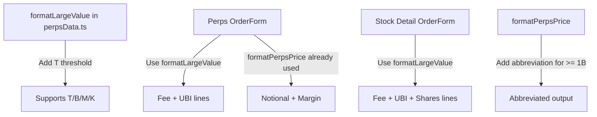

## Problem Statement

When users enter very large position sizes in the Perps trade panel or the Stock Detail trade panel, computed values (Notional, Margin, Fee, UBI Pool, Est. Shares) render as extremely long unabbreviated strings that overflow their containers. For example, entering "99999999999999" in the perps Size field produces:
- Notional: `$6,012,579,999,999,941,000.00` (overflows the sidebar)
- Margin: `$601,257,999,999,994,100.00`
- Fee: `$300628999999970.50` (raw `.toFixed(2)`, no commas or abbreviation)
- UBI (33%): `$99207569999990.25`

Similarly on Stock Detail (`/stocks/MSFT`), entering a huge dollar amount shows:
- Est. Shares: `24061597690.0842 MSFT` (overflows)
- Fee: `$10000000000.00`
- UBI Pool: `$3300000000.00`

The app already has a `formatLargeValue` function in `perpsData.ts` and `compactAmount` in `format.ts` that handle abbreviation (K/M/B/T), but neither is used for these computed fields.

## User Story

As a trader entering a position size, I want computed values (Notional, Margin, Fee, Shares) to display in a compact, readable format so the trade panel doesn't break visually.

## How It Was Found

During edge-case testing: entered "99999999999999" in the Perps Size field and "9999999999999" in the Stock Detail Amount field. Both caused computed values to overflow their containers. Screenshots captured showing the overflow.

## Proposed UX

- All computed monetary values in trade panels should use abbreviated formatting: `$1.23B`, `$45.6M`, `$789K`.
- Use the existing `formatLargeValue` from `perpsData.ts` for the perps Fee and UBI fee lines (currently using `fee.toFixed(2)`).
- Use `formatLargeValue` (or a similar utility) for the stock detail Est. Shares, Fee, and UBI Pool values.
- Add `overflow-hidden text-ellipsis` or `truncate` as a safety net on value containers.
- The swap card already uses `compactAmount` on mobile; ensure desktop also truncates for very long outputs.

## Acceptance Criteria

- [ ] Perps trade panel: Fee and UBI fee lines use `formatLargeValue` instead of raw `.toFixed(2)`.
- [ ] Perps trade panel: Notional and Margin use abbreviated formatting for values >= 1B.
- [ ] Stock detail trade panel: Est. Shares uses compact formatting for values >= 1M.
- [ ] Stock detail trade panel: Fee and UBI Pool use `formatLargeValue` for large values.
- [ ] No value in any trade panel exceeds its container width visually.
- [ ] Existing tests still pass.
- [ ] New tests verify large-value formatting in trade panels.

## Verification

- Run `npx vitest run` — all tests must pass.
- Enter `99999999999999` in perps Size field — values should show abbreviated (e.g., `$6.01T`, `$601.3B`).
- Enter `9999999999999` in stock detail Amount field — values should show abbreviated.

## Overview

Fix computed monetary values in Perps and Stock Detail trade panels to use abbreviated formatting (K/M/B/T) when values are very large, preventing visual overflow.

## Research Notes

- `formatPerpsPrice` in `lib/perpsData.ts` (line 164) formats with `toLocaleString` for values >= 1000 — adds commas but doesn't abbreviate, so `$6,012,579,999,999,941,000.00` is output.
- `formatLargeValue` in `lib/perpsData.ts` (line 172) handles B/M/K abbreviation but not T (trillion). It's not used for Fee/UBI in the order form.
- Perps Fee (line 208) uses raw `$${fee.toFixed(2)}` — no formatting.
- Perps UBI (line 209) uses raw `$${ubiFee.toFixed(2)}` — no formatting.
- Stock Detail Est. Shares (line 83) uses `shares.toFixed(4)`.
- Stock Detail Fee (line 91) uses `$${fee.toFixed(2)}`.
- Stock Detail UBI Pool (line 95) uses `$${ubiFee.toFixed(2)}`.
- `compactAmount` in `lib/format.ts` is a general-purpose abbreviation function that could be reused.

## Architecture

## One-Week Decision

**YES** — This is a focused formatting change across two files. The formatting functions already exist and just need to be applied. Estimated effort: 2-3 hours.

## Implementation Plan

1. Extend `formatLargeValue` in `perpsData.ts` to handle trillions (`>= 1e12`).
2. Upgrade `formatPerpsPrice` to use abbreviated formatting for values >= 1B (to keep the Notional/Margin fields compact).
3. In `perps/page.tsx` OrderForm, replace `$${fee.toFixed(2)}` and `$${ubiFee.toFixed(2)}` with `formatLargeValue(fee)` and `formatLargeValue(ubiFee)`.
4. Create/export a `formatCompactShares` utility for large share counts.
5. In `stocks/[ticker]/page.tsx` OrderForm, replace `shares.toFixed(4)`, `$${fee.toFixed(2)}`, and `$${ubiFee.toFixed(2)}` with the appropriate formatting functions.
6. Add `truncate` CSS class as safety net on value containers.
7. Write tests for the formatting edge cases.

## Out of Scope

- Adding maximum input length to perps/stock inputs (separate initiative 0082).
- Changing the swap card behavior.
- Refactoring the mock data layer.
