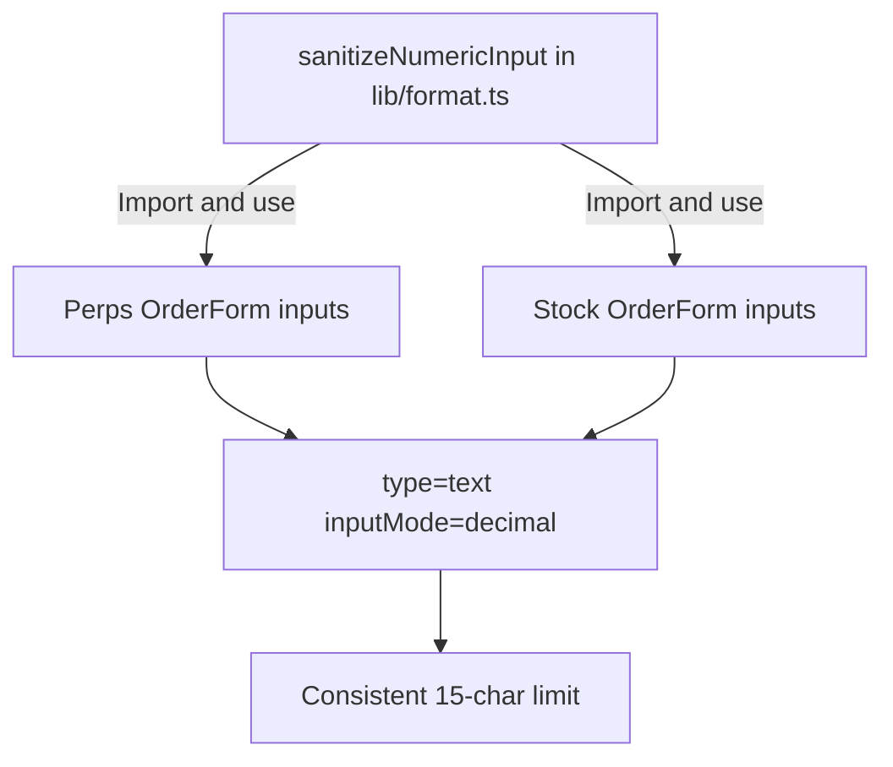

## Problem Statement

The Swap card uses `sanitizeNumericInput` from `lib/format.ts` which limits input to 20 characters and strips non-numeric characters. However, the Perps size input and the Stock Detail amount input use raw `<input type="number">` with no character limit or input sanitization. Users can enter arbitrarily long numbers (e.g., 30+ digits), which causes computed values to overflow and can potentially cause floating-point precision issues.

The Perps page uses a custom `sanitizePositiveInput` for limit/trigger price fields but the Size field only applies the same function — it strips negatives but doesn't cap length. The Stock Detail page has no input sanitization at all.

## User Story

As a trader, I want input fields to prevent me from entering unreasonably large numbers so the trade panel stays readable and I'm not confused by overflow or precision artifacts.

## How It Was Found

During edge-case testing of boundary conditions. Entered "99999999999999" (14 digits) and "9999999999999" (13 digits) into the Perps size and Stock detail amount fields respectively. Both accepted the full number. The Swap card limits to 20 chars — the perps and stock forms should have similar constraints.

## Proposed UX

- Apply `sanitizeNumericInput` (or equivalent) to the Perps Size input to limit length to 15 characters (covering reasonable position sizes).
- Apply `sanitizeNumericInput` (or equivalent) to the Stock Detail Amount input.
- Apply the same sanitization to Perps Limit Price and Trigger Price inputs.
- Change `<input type="number">` to `<input type="text" inputMode="decimal">` to enable consistent cross-browser sanitization (matching the swap card pattern).

## Acceptance Criteria

- [ ] Perps Size input limited to 15 characters max, strips non-numeric except decimal point.
- [ ] Perps Limit Price and Trigger Price inputs limited to 15 characters max.
- [ ] Stock Detail Amount input limited to 15 characters max, strips non-numeric except decimal point.
- [ ] Input type changed from `number` to `text` with `inputMode="decimal"` for consistent behavior.
- [ ] Existing tests still pass.
- [ ] New tests verify input sanitization.

## Verification

- Run `npx vitest run` — all tests must pass.
- On `/perps`, try pasting a 30-character number into the Size field — it should be truncated to 15 characters.
- On `/stocks/MSFT`, try pasting a 30-character number into the Amount field — it should be truncated.

## Overview

Apply the same input sanitization pattern used in the SwapCard to the Perps and Stock Detail trade forms, preventing arbitrarily long numeric inputs.

## Research Notes

- SwapCard uses `sanitizeNumericInput` from `lib/format.ts` — strips non-numeric except `.`, caps at 20 chars, removes leading zeros.
- Perps Size input: `<input type="number">` at `perps/page.tsx` line 196, uses `sanitizePositiveInput` (local function at line 96) — only strips negatives, no length cap.
- Perps Limit/Trigger Price: `<input type="number">` at lines 178, 187, also use `sanitizePositiveInput`.
- Stock Amount: `<input type="number">` at `stocks/[ticker]/page.tsx` line 75, no sanitization.
- Stock Limit Price: `<input type="number">` at line 68, no sanitization.
- Changing `type="number"` to `type="text" inputMode="decimal"` enables consistent sanitization.

## Architecture

## One-Week Decision

**YES** — Changing 5 input elements from `type="number"` to `type="text" inputMode="decimal"` and adding `sanitizeNumericInput` calls. Estimated effort: 1-2 hours.

## Implementation Plan

1. In `perps/page.tsx`, change Size input from `type="number"` to `type="text" inputMode="decimal"`, replace `sanitizePositiveInput` with `sanitizeNumericInput` from `lib/format.ts`.
2. Do the same for Limit Price and Trigger Price inputs in perps.
3. In `stocks/[ticker]/page.tsx`, change Amount and Limit Price inputs similarly.
4. Remove the local `sanitizePositiveInput` function if no longer used.
5. Write tests verifying input sanitization.
6. Verify existing tests still pass.

## Out of Scope

- Changing the output formatting (covered in initiative 0081).
- Modifying the swap card (already has sanitization).
- Adding balance-based validation.
