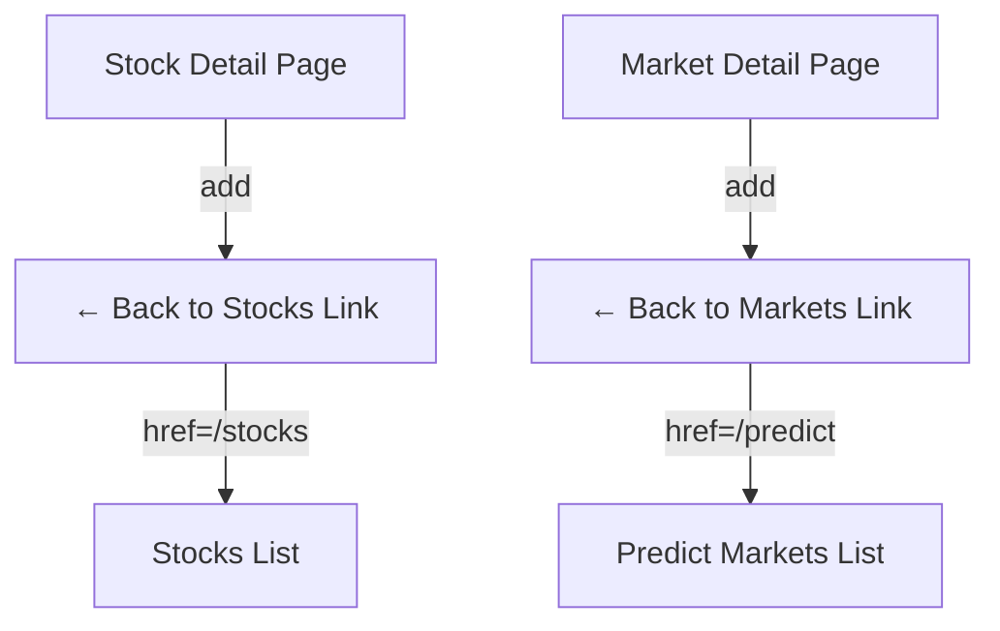

## Problem Statement

When a user navigates to a stock detail page (`/stocks/AAPL`) or a prediction market detail page (`/predict/[marketId]`), there is no breadcrumb or "← Back" link to help them return to the parent list. The only way to go back is to click the "Markets" tab in the sub-navigation. This creates navigation friction — the user has to figure out which tab returns them to the list, rather than having an obvious "← Back to Stocks" or "← Back to Markets" link.

## User Story

As a user viewing a stock detail or prediction market detail page, I want a clear breadcrumb or back link at the top of the content area, so that I can quickly navigate back to the list of all stocks or markets.

## How It Was Found

During UX flow testing (Journeys: "User researches a stock" and "User explores prediction markets"):
1. Navigated to `/stocks/AAPL` by clicking a row in the stocks table
2. Observed no breadcrumb, back link, or clear "return to list" affordance
3. Same observation on `/predict/[marketId]` — no breadcrumb
4. User must discover the "Markets" tab to navigate back
5. Perps doesn't have individual pair URLs so this doesn't apply there

## Proposed UX

Add a breadcrumb row above the content heading on detail pages:

**Stock detail** (`/stocks/AAPL`):
```
← Back to Stocks
```
Rendered as a subtle link above the stock header (AAPL / Apple Inc. / price).

**Predict market detail** (`/predict/[marketId]`):
```
← Back to Markets
```
Rendered as a subtle link above the market question heading.

**Styling:**
- Text: `text-sm text-slate-400 hover:text-teal-400`
- Arrow: `←` or a chevron icon
- Positioned flush left above the main content heading
- Should look like a navigation affordance, not a full breadcrumb trail

## Acceptance Criteria

- [ ] `/stocks/[ticker]` pages show a "← Back to Stocks" link above the stock header
- [ ] Clicking the link navigates to `/stocks` (the Markets tab)
- [ ] `/predict/[marketId]` pages show a "← Back to Markets" link above the market heading
- [ ] Clicking the link navigates to `/predict`
- [ ] Links use client-side navigation (Next.js Link)
- [ ] Styling is subtle and consistent with the dark theme
- [ ] Existing page layout and content is not disrupted

## Verification

- Run full test suite
- Verify in browser with agent-browser on both stock detail and predict market detail pages

## Out of Scope

- Adding breadcrumbs to perps (no individual pair pages)
- Full multi-level breadcrumb trails (e.g., "Home > Stocks > AAPL")
- Breadcrumbs on portfolio pages

## Planning

### Overview

Add a "← Back to Stocks" link above the stock header on `/stocks/[ticker]` and a "← Back to Markets" link above the market heading on `/predict/[marketId]`. Both are simple Next.js `<Link>` additions to existing pages.

### Research Notes

- Stock detail page: `frontend/src/app/stocks/[ticker]/page.tsx` — the content starts with the stock icon and heading at line 143. The breadcrumb link should be inserted just before this.
- Predict market detail page: `frontend/src/app/predict/[marketId]/page.tsx` — content starts with the category badge at line 135. The breadcrumb should go before the badge.
- Both pages are client components using `'use client'`
- Both already import `Link` from `next/link`

### Architecture Diagram



### One-Week Decision

**YES** — This is a few-line addition to two existing files. Approximately 20 minutes of work.

### Implementation Plan

1. In `frontend/src/app/stocks/[ticker]/page.tsx`: Add a back link above the stock header section
2. In `frontend/src/app/predict/[marketId]/page.tsx`: Add a back link above the category badge  
3. Style both links as `text-sm text-slate-400 hover:text-teal-400 transition-colors`
4. Write tests for both pages verifying the breadcrumb link renders and has correct href
5. Verify in browser
