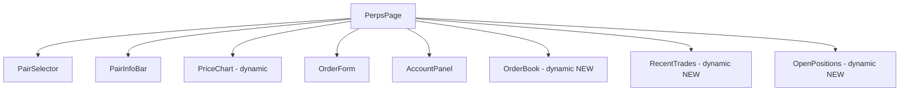

## Problem Statement

The Perps page (`/perps`) eagerly imports three below-fold components: `OrderBook`, `RecentTrades`, and `OpenPositions`. These are rendered below the main chart and order form, meaning users must scroll to see them. Their synchronous import increases the initial JS bundle for the perps route (currently 98.8 kB first load). The `PriceChart` is already dynamically imported, but these three aren't.

## User Story

As a trader opening the perps page, I want the chart and order form to load as fast as possible, with the order book and trade feed loading progressively as I scroll.

## How It Was Found

Bundle analysis via `next build` output showed perps at 98.8 kB first load. Code review confirmed `OrderBook`, `RecentTrades`, and `OpenPositions` are statically imported even though they render below the fold. The `PriceChart` already uses `dynamic()` for the same reason.

## Proposed UX

- Convert `OrderBook`, `RecentTrades`, and `OpenPositions` imports to `next/dynamic` with `ssr: false` and skeleton loading fallbacks
- The skeleton fallbacks should match the current component dimensions (card outline with pulsing rows)
- No visual change once loaded — same layout and functionality

## Acceptance Criteria

- [ ] All three components use `next/dynamic` with `ssr: false`
- [ ] Each has a skeleton loading fallback matching its approximate height
- [ ] Perps page first load JS decreases (verify via `next build` output)
- [ ] No layout shift when components load
- [ ] Build passes with no new warnings

## Verification

- Run `npm run build` and confirm perps route first load JS decreased
- Open `/perps` in browser and confirm all three sections load correctly
- Check there's no visible layout shift on load

## Out of Scope

- Intersection observer / scroll-triggered loading (too complex for this task)
- Refactoring OrderBook/RecentTrades data generation

## Planning

### Overview

Convert three static imports in `frontend/src/app/perps/page.tsx` to `next/dynamic` with `ssr: false` and skeleton fallbacks.

### Research Notes

- `PriceChart` already uses `dynamic()` in this file (lines 9–17), providing an established pattern.
- `OrderBook` renders a 12-level bid/ask table (~300px height).
- `RecentTrades` renders a 20-row trade list (~300px height).
- `OpenPositions` renders a variable-height positions table.
- All three are only visible after scrolling past the chart + order form.

### Architecture

### One-Week Decision

**YES** — Simple dynamic import conversion with skeleton fallbacks (~30 min).

### Implementation Plan

1. Replace static imports of `OrderBook`, `RecentTrades`, `OpenPositions` with `dynamic()` using `ssr: false`.
2. Add skeleton loading fallbacks matching each component's approximate dimensions.
3. Verify build output shows reduced first-load JS for `/perps`.
4. Visual verification in browser — no layout shift, components load smoothly.
