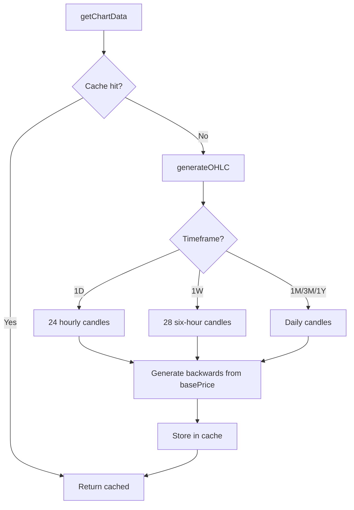

## Overview

Fix the chart data generation in `chartData.ts` so that short timeframes (1D, 1W) produce enough candles to look realistic, and the final candle's close price always matches the current mark price.

## Research Notes

- Current `TIMEFRAME_DAYS` maps: 1D→1, 1W→7, 1M→30, 3M→90, 1Y→365
- `generateOHLC` creates one data point per day, so 1D=2 points, 1W=8 points
- Fix: for 1D use hourly intervals (24 points), for 1W use 6-hour intervals (28 points)
- Price generation currently starts at `basePrice * (0.85 + random * 0.15)` and drifts forward
- Fix: generate backwards from `basePrice` so the last candle's close = mark price
- The `time` field format needs ISO date strings for daily candles and ISO datetime for intraday

## Assumptions

- Lightweight Charts (TradingView) accepts ISO datetime strings like "2026-04-03T09:00:00" for intraday data
- The chart cache keyed by `symbol + timeframe` is sufficient

## Architecture Diagram

## One-Week Decision

**YES** — Single file change to `chartData.ts`. The `generateOHLC` function needs parameter additions for interval type and backward generation logic. Approximately 1-2 hours of work.

## Implementation Plan

1. Refactor `TIMEFRAME_DAYS` into a richer config: `{ points: number, intervalMs: number, labelFormat: string }`
2. Modify `generateOHLC` to accept interval config and generate data backwards from `basePrice`
3. For 1D: 24 points at 1-hour intervals, time labels as ISO datetime
4. For 1W: 28 points at 6-hour intervals, time labels as ISO datetime
5. For 1M/3M/1Y: keep daily candles, time labels as ISO date
6. The final data point's close = `basePrice` exactly
7. Clear the chart cache concept stays the same (keyed by symbol+timeframe)

## Problem Statement

Two related issues with the Perps chart make it look broken and confusing:

1. **1D timeframe shows only 2 candles**: `TIMEFRAME_DAYS['1D'] = 1` generates only 2 OHLC data points (i=0 and i=1). The chart shows just 2 extremely wide bars, looking broken compared to any real trading platform that shows hourly or 15-minute candles for a 1-day view.

2. **Chart's final price diverges from displayed mark price**: The chart data generator starts at `basePrice * (0.85 + random * 0.15)` and applies random drift. The final candle's close can be far from the mark price shown in the info bar. For BTC-USD, the mark price shows $60,125.80 but the chart may show prices around $51,000-$53,000. This creates cognitive dissonance for users.

## User Story

As a perps trader, I want the chart to show a realistic number of candles at every timeframe and have the final candle's close price match the displayed mark price, so I can trust the visual data and make informed trading decisions.

## How It Was Found

During deep-dive testing of the Perps trading page, switching to the 1D timeframe revealed only 2 massive candlesticks. Switching between timeframes showed that 1D and 1W were notably sparse. Additionally, comparing the chart's price axis ($51,000-$53,000 range) against the mark price bar ($60,125.80) revealed an ~15% divergence.

## Proposed UX

- **1D timeframe**: Generate 24 hourly candles (24 data points)
- **1W timeframe**: Generate 7 × 4 = 28 candles (6-hour intervals)
- **1M, 3M, 1Y**: Keep as daily candles (current behavior is fine)
- **Price convergence**: Ensure the last candle's close price equals the `basePrice` parameter. Generate data backwards from the current price.

## Acceptance Criteria

- [ ] 1D timeframe shows 24 data points (hourly candles) instead of 2
- [ ] 1W timeframe shows ~28 data points (6-hour intervals) instead of 8
- [ ] The final (most recent) candle's close price equals the `basePrice` parameter passed to `getChartData()`
- [ ] Chart data is generated by walking backwards from the current price, not forwards from a random starting point
- [ ] Time labels on 1D chart show hours (e.g. "09:00", "10:00"), not dates
- [ ] Existing 1M/3M/1Y charts continue to work correctly with daily candles
- [ ] Chart cache is cleared when underlying data changes

## Verification

- Run all tests
- Verify in browser: switch through all 5 timeframes on BTC-USD and ETH-USD, confirm candle count and price alignment

## Out of Scope

- Real-time streaming price data
- WebSocket-based chart updates
- Candlestick aggregation controls (1m/5m/15m/1h)
