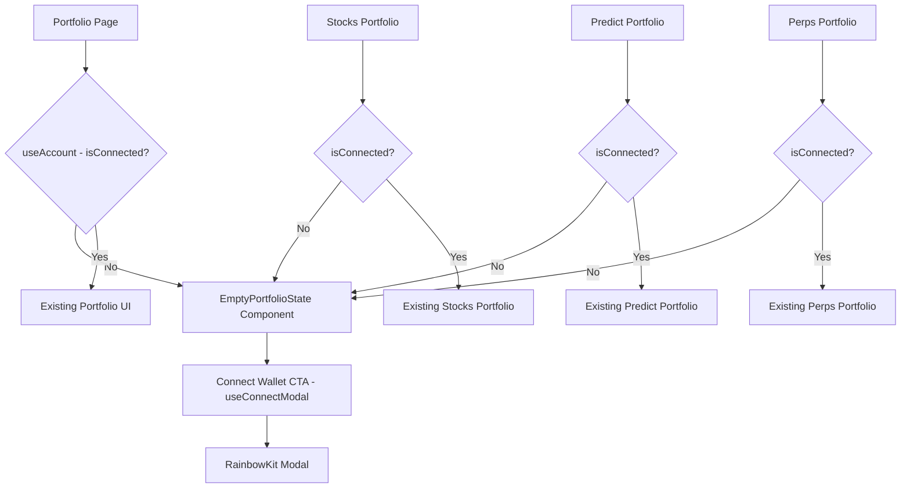

## Problem Statement

The Portfolio page (`/portfolio`) displays hardcoded mock data ($15K total value, 11 active positions, specific AAPL/TSLA/NVDA stocks, prediction market positions, and perps positions) regardless of whether a wallet is connected. A first-time user landing on this page sees what looks like someone else's portfolio data. This is confusing, undermines trust, and makes the app look buggy — a user might think they're seeing another person's data or a security issue.

## User Story

As a first-time visitor without a connected wallet, I want to see a clear empty state on the Portfolio page that explains I need to connect my wallet, so that I understand the page requires authentication and I'm not confused by fake data.

## How It Was Found

During fresh-eyes product review: navigated to `/portfolio` without connecting a wallet and observed hardcoded mock data displayed as if it were real portfolio positions. Screenshots confirmed $15K total value, stocks, predictions, and perps positions all showing without any wallet connection.

## Proposed UX

When no wallet is connected, the Portfolio page should show:
1. A centered empty-state illustration or icon (e.g., a wallet icon or portfolio chart outline)
2. A heading like "Your Portfolio" or "Connect to View Your Portfolio"
3. A brief description: "Connect your wallet to view your stocks, predictions, and perpetual futures positions."
4. A prominent "Connect Wallet" CTA button (using the existing RainbowKit connect flow)
5. Optionally, a preview of what the portfolio tracks: "Track your Stocks • Predictions • Perpetual Futures — all in one place"

The existing mock data display should only render when `useAccount()` returns a connected address.

## Acceptance Criteria

- [ ] When no wallet is connected, the Portfolio page shows an empty state with a Connect Wallet CTA
- [ ] The empty state includes a brief explanation of what the portfolio tracks
- [ ] Clicking the Connect Wallet CTA opens the wallet connection modal
- [ ] When a wallet IS connected, the existing portfolio UI renders (keeping current mock data for now)
- [ ] The sub-portfolio pages (Stocks Portfolio, Predict Portfolio, Perps Portfolio) also show empty states when disconnected
- [ ] All existing tests continue to pass
- [ ] Mobile layout is clean and centered

## Verification

- Run `npx vitest run` — all tests pass
- Open `/portfolio` in browser without connecting wallet — empty state shown
- Connect wallet — portfolio data renders
- Check mobile viewport — empty state is responsive

## Out of Scope

- Fetching real portfolio data from on-chain (keep existing mock data for connected state)
- Adding wallet connection logic (use existing RainbowKit integration)
- Redesigning the portfolio layout when connected

---

## Planning

### Overview

Add wallet-aware empty states to 4 portfolio pages: `/portfolio`, `/stocks/portfolio`, `/predict/portfolio`, `/perps/portfolio`. When `useAccount()` returns no connected address, display a centered empty state with an icon, description, and a Connect Wallet CTA button that triggers the RainbowKit modal via `useConnectModal()`.

### Research Notes

- The project already uses `wagmi` + `@rainbow-me/rainbowkit` for wallet connection (see `WalletProviders.tsx`, `SwapWalletActions.tsx`).
- `useAccount()` from `wagmi` provides `isConnected` and `address`.
- `useConnectModal()` from `@rainbow-me/rainbowkit` provides `openConnectModal()` to trigger the wallet connection dialog.
- All 4 portfolio pages are client components (`'use client'` or can be converted).
- The main portfolio page (`/portfolio/page.tsx`) is already a client component.

### Architecture Diagram

### One-Week Decision

**YES** — This is a straightforward conditional rendering change across 4 pages plus one shared empty-state component. Estimated effort: 2-3 hours.

### Implementation Plan

1. Create a shared `ConnectWalletEmptyState` component in `src/components/` with:
   - Wallet icon SVG
   - Title ("Connect Your Wallet")
   - Description ("Connect your wallet to view your positions across stocks, predictions, and perpetual futures.")
   - Connect Wallet button that calls `openConnectModal()` from `useConnectModal()`
2. Update `/portfolio/page.tsx` — wrap existing content in `isConnected` check, show `ConnectWalletEmptyState` when disconnected
3. Update `/stocks/portfolio/page.tsx` — same pattern
4. Update `/predict/portfolio/page.tsx` — same pattern
5. Update `/perps/portfolio/page.tsx` — same pattern
6. Add test for the empty state component
7. Verify mobile responsiveness
