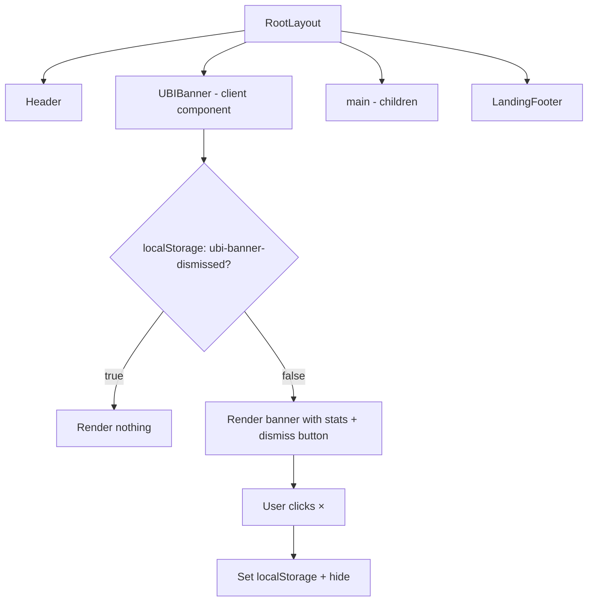

## Problem Statement

GoodDollar's core differentiator — that every trade funds universal basic income — is only visible on the homepage below the fold. Once a user navigates to Stocks, Predict, Perps, or Explore, there is no reminder of the UBI impact. The "0.1% funds UBI" badge on the swap card is too small and only on the swap page. A first-time user trading on the Stocks or Perps page has no visible indication that their activity is funding UBI, which is the entire value proposition of the platform.

## User Story

As a trader on GoodDollar, I want to see a persistent, subtle UBI impact indicator across all pages so that I'm constantly reminded that my trading activity is making a difference, which reinforces why I chose this platform over competitors.

## How It Was Found

During fresh-eyes product review: navigated through Stocks, Predict, and Perps pages and noticed zero mention of UBI impact. The platform's differentiator is invisible during actual usage. Only the homepage (below the fold) shows UBI stats ($2.4M distributed, 640K+ claimers).

## Proposed UX

Add a slim, non-intrusive banner just below the main navigation header on all pages. Design:

- Height: ~32px, background slightly lighter than the page bg (e.g., `rgba(16, 185, 129, 0.08)`)
- Content: A single line with a green heart icon + text like: "💚 $2.4M distributed to 640K+ people through UBI — funded by your trades"
- The text should use the same mock stats from the homepage footer
- Dismissable with a small × button (persists dismissal in localStorage so it doesn't reappear)
- Optionally links to a "Learn more" anchor on the homepage How It Works section

The banner should be subtle enough to not distract from trading but visible enough that a first-time user notices the UBI message.

## Acceptance Criteria

- [ ] A slim UBI impact banner appears below the header on all pages (Swap, Explore, Pool, Bridge, Stocks, Predict, Perps, Portfolio)
- [ ] Banner shows UBI stats (total distributed, number of claimers)
- [ ] Banner is dismissable via × button
- [ ] Dismissal persists across page navigations (localStorage)
- [ ] Banner does NOT appear on pages where it was previously dismissed
- [ ] Banner styling matches the dark theme and does not clash with page content
- [ ] Banner is responsive and looks good on mobile
- [ ] All existing tests continue to pass

## Verification

- Run `npx vitest run` — all tests pass
- Navigate all pages — banner visible on each
- Dismiss banner — it stays dismissed across navigations
- Refresh page — banner stays dismissed
- Check mobile — banner text doesn't overflow

## Out of Scope

- Fetching real UBI distribution data from on-chain
- Animating the stats or adding a real-time counter
- Adding the banner to detail/sub-pages (only main navigation pages)

---

## Planning

### Overview

Add a slim `UBIBanner` component rendered in the root layout (`layout.tsx`) between the `<Header />` and `<main>`. It shows a single-line UBI impact message and can be dismissed via a close button. Dismissal is persisted in `localStorage`.

### Research Notes

- The root layout (`src/app/layout.tsx`) renders `<Header />` then `<main>`. The banner should go between them.
- The layout is a server component, so the banner must be a client component imported with `'use client'`.
- The existing `StatsRow` component at the bottom of the homepage uses mock stats: `$2.4M` distributed, `640K+` claimers, `1.2M` swaps. We'll reuse the same data.
- localStorage key: `ubi-banner-dismissed` with value `"true"`.

### Architecture Diagram

### One-Week Decision

**YES** — Single component + one line added to layout. Estimated effort: 1-2 hours.

### Implementation Plan

1. Create `src/components/UBIBanner.tsx` — client component with:
   - `useState` + `useEffect` to check localStorage on mount
   - Slim bar (~32-36px) with teal/green accent background
   - Green heart emoji + impact stat text
   - Dismiss × button on the right
   - On dismiss: set localStorage and hide
2. Import `UBIBanner` in `src/app/layout.tsx` between `<Header />` and `<main>`
3. Add test for render + dismiss behavior
4. Verify mobile layout
