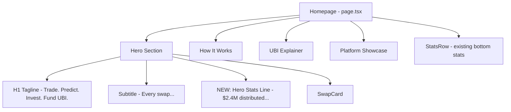

## Problem Statement

The homepage hero tagline reads "Trade. Predict. Invest. Fund UBI." but uses the abbreviation "UBI" without defining it. While the subtitle mentions "universal basic income," the tagline itself — the most prominent text on the page — leaves first-time users who don't know the abbreviation confused about what UBI means. The "How It Works" section below the fold explains it well, but users who don't scroll will miss it entirely.

Additionally, the hero section lacks any concrete impact number that would motivate a first-time user to engage. The stats ($2.4M distributed, 640K+ claimers) are at the very bottom of the page.

## User Story

As a first-time visitor who has never heard of GoodDollar, I want to immediately understand what "UBI" means and see evidence of real impact in the hero section, so that I understand why this platform is different and am motivated to explore further.

## How It Was Found

During fresh-eyes product review: landed on the homepage and saw "Fund UBI" in the tagline. As a simulated first-time user, "UBI" is jargon. The subtitle explains it in smaller text, but the initial impression from the hero is unclear. Scrolling reveals excellent explanatory content, but the above-the-fold impression doesn't convey the full value proposition.

## Proposed UX

Option A (preferred): Add a small animated stat counter or badge near the hero tagline:
- Below the subtitle, add a single-line stat like: "🌍 $2.4M already distributed to 640K+ people worldwide"
- This surfaces the proof-of-impact above the fold
- Keep the existing tagline and subtitle unchanged

Option B: Modify the tagline to include the definition:
- Change to "Trade. Predict. Invest. Fund Universal Basic Income."
- Shorter alternative: keep "Fund UBI" but add a tooltip or parenthetical

The implementation should add a hero stat line between the subtitle and the swap card, using the same mock data already used at the bottom of the page. The stat should be styled subtly (muted text, smaller than subtitle) but clearly visible.

## Acceptance Criteria

- [ ] A UBI impact stat line is visible in the hero section above the fold
- [ ] The stat shows total UBI distributed and number of claimers (matching footer stats)
- [ ] The stat is styled consistently with the dark theme (muted/secondary text color)
- [ ] The stat line is responsive and looks good on mobile
- [ ] The existing hero tagline and subtitle remain unchanged
- [ ] All existing tests continue to pass
- [ ] The stat does not crowd or overlap the swap card

## Verification

- Run `npx vitest run` — all tests pass
- Open homepage — UBI stat visible in hero without scrolling
- Check mobile viewport — stat doesn't break layout
- Compare with full-page screenshot — stat sits naturally between subtitle and swap card

## Out of Scope

- Animating the counter
- Fetching real data from on-chain
- Changing the existing tagline text
- Modifying the "How It Works" section

---

## Planning

### Overview

Add a single-line hero stat below the subtitle in the homepage hero section (`src/app/page.tsx`). The stat surfaces proof-of-impact above the fold using the same mock numbers already displayed in the `StatsRow` component at the bottom of the page.

### Research Notes

- The homepage hero is in `src/app/page.tsx` — it's a server component that renders the tagline, subtitle, and `SwapCard`.
- The `StatsRow` component (dynamically imported at bottom) shows: `$2.4M` UBI Distributed, `640K+` Daily Claimers, `1.2M` Total Swaps.
- The hero stat line is purely static text — no client-side interactivity needed, so it can stay as server-rendered HTML.
- Styling should use muted/secondary colors (`text-gray-500` or similar) and be smaller than the subtitle.

### Architecture Diagram

### One-Week Decision

**YES** — A single line of HTML/CSS added to the homepage. Estimated effort: 30 minutes.

### Implementation Plan

1. Edit `src/app/page.tsx` — add a stat line element between the subtitle `
` and the swap card wrapper
2. Style: `text-xs text-gray-500` with a globe or heart icon, centered
3. Text: "🌍 $2.4M distributed to 640K+ people worldwide"
4. Verify it looks good on both desktop and mobile viewports
5. Ensure it doesn't push the swap card too far down on mobile
