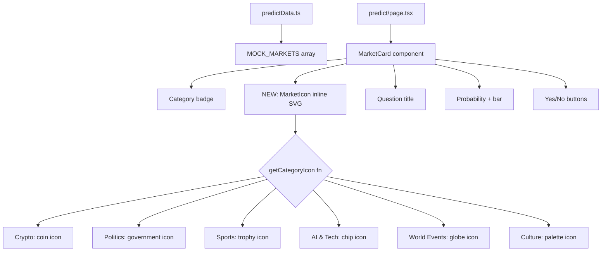

## Problem Statement

Our prediction market cards are plain text-only with no visual imagery. Polymarket prominently displays thumbnail images on every market card — from sports event logos to political candidate photos to crypto icons. This makes their markets visually scannable and engaging. Our predict page looks sterile and generic by comparison, with cards that blend together because there's no visual differentiation beyond the category badge color.

## User Story

As a prediction market user, I want to see relevant thumbnail images on market cards so that I can quickly scan and identify markets of interest, making the browsing experience more engaging and visually rich.

## How It Was Found

Side-by-side comparison of our Predict page vs Polymarket. Polymarket's homepage immediately catches the eye with card images (NCAA basketball photo, Bitcoin icon, WTI crude oil chart). Our 3 active markets are text-only cards that look like generic data entries rather than engaging betting opportunities.

## Proposed UX

Add a small circular or rounded-square thumbnail image (32-40px) to the left of each market card's question title. Use category-appropriate placeholder images:
- **Crypto** markets: relevant token icon (Bitcoin, Ethereum logos)
- **Politics** markets: government/political icon or flag
- **Sports** markets: sport-specific icon (basketball, soccer ball)
- **AI & Tech** markets: tech/robot icon
- **World Events** markets: globe icon
- **Culture** markets: culture/entertainment icon

Implementation: Add an `icon` or `imageUrl` field to the `PredictionMarket` interface with category-based fallback SVG icons. Display the thumbnail in the market card header row alongside the category badge.

## Acceptance Criteria

- [ ] Each market card displays a thumbnail image/icon next to the question title
- [ ] Thumbnails are category-appropriate (crypto icon for crypto markets, etc.)
- [ ] Thumbnails are consistent in size (32-40px), rounded
- [ ] Cards look visually richer and more engaging than before
- [ ] Layout doesn't break on mobile
- [ ] All existing tests pass

## Verification

- Run `npx vitest run` — all tests pass
- Open /predict — all market cards show thumbnails
- Check mobile viewport — thumbnails don't cause overflow
- Compare visual richness vs previous text-only cards

## Out of Scope

- Fetching real images from external APIs
- User-uploaded market images
- Full hero/featured market layout (separate initiative)

---

## Planning

### Overview

Add category-appropriate SVG icon thumbnails to prediction market cards. Each card will display a 36px rounded icon next to the question title, using inline SVGs mapped by category (Crypto, Politics, Sports, AI & Tech, World Events, Culture). Some markets can also match by keyword (e.g., "Bitcoin" → BTC icon).

### Research Notes

- The `MarketCard` component is defined inline in `src/app/predict/page.tsx` (not a separate component file).
- The `PredictionMarket` interface in `src/lib/predictData.ts` has no image/icon field — we'll add a category-based icon mapping utility.
- The existing card layout has: category badge (top-left), time label (top-right), question title, probability, yes/no buttons, vol/liquidity footer.
- The icon should go in the title row: icon on the left, question text on the right, creating a more visually distinctive card header.
- We can reuse the existing `TokenIcon` pattern for category icons but with custom SVGs since these are categories not tokens.

### Architecture Diagram

### One-Week Decision

**YES** — Adding inline SVG icons with a category mapping function is ~1-2 hours of work. No external dependencies, no data model changes needed.

### Implementation Plan

1. Create a `getCategoryIcon(category: MarketCategory): JSX.Element` utility function in `predict/page.tsx` that returns an inline SVG for each category
2. Update the `MarketCard` component to render the icon in a 36px circle next to the question title
3. Add keyword-based icon overrides for specific markets (e.g., "Bitcoin" → BTC-style icon)
4. Style the icon container with category-appropriate accent colors
5. Verify mobile layout — icons should shrink gracefully or maintain fixed size
