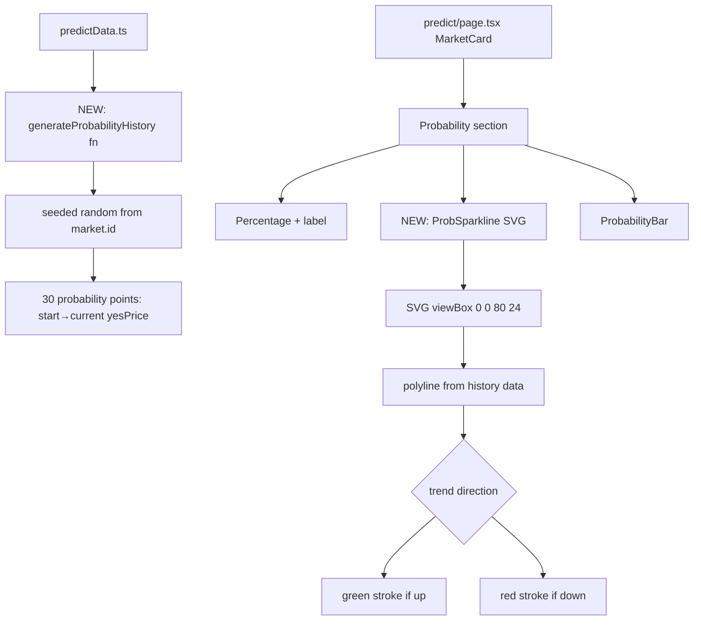

## Problem Statement

Our prediction market cards show only the current probability as a static percentage. Polymarket embeds interactive probability history charts directly in their featured market cards, showing how the probability has changed over time. This trend information is crucial for traders — a market at 48% that was at 65% last week tells a very different story than one that's been steady at 48%. Without trend visualization, users have no way to gauge momentum or recent movements at a glance.

## User Story

As a prediction market trader, I want to see a small probability trend sparkline on each market card so that I can quickly assess whether a market's probability is trending up, down, or sideways before clicking into the detail page.

## How It Was Found

Side-by-side comparison of our Predict page vs Polymarket. Polymarket shows probability over time charts on featured market cards with colored lines for each outcome. Our cards show only a static "48% chance" with a probability bar, providing no historical context.

## Proposed UX

Add a small SVG sparkline (about 60px wide × 24px tall) to each market card, positioned between the probability percentage and the Yes/No buttons. The sparkline should:
- Show the last 30 days of mock probability data points
- Use green color for upward trends, red for downward
- Be purely decorative (no interactivity) — full charts are on the detail page
- Generate mock historical data by interpolating from a starting probability to the current `yesPrice`

The sparkline should be lightweight — use a simple SVG polyline, not the full ProbabilityChart/lightweight-charts library (which would be too heavy for cards).

## Acceptance Criteria

- [ ] Each active market card shows a small probability trend sparkline
- [ ] Sparkline shows approximately 30 data points of probability history
- [ ] Up-trending sparklines use green color, down-trending use red
- [ ] Sparkline is compact (max 60-80px wide, 20-28px tall)
- [ ] Mock probability history data is generated deterministically per market (same data on every render)
- [ ] Expired market cards do NOT show sparklines
- [ ] All existing tests pass
- [ ] No performance impact from rendering sparklines (pure SVG, no chart library)

## Verification

- Run `npx vitest run` — all tests pass
- Open /predict — all active market cards show sparklines
- Check mobile viewport — sparklines scale appropriately
- Verify sparklines show sensible trends (not random noise)

## Out of Scope

- Interactive/zoomable charts on cards (use the detail page for that)
- Real historical data
- Full ProbabilityChart component on cards (too heavy)

---

## Planning

### Overview

Add a lightweight SVG sparkline to each active prediction market card showing probability trend over the last ~30 days. Use a deterministic seeded random generator (like the existing `Sparkline` component on the Explore page) to produce mock probability history, then render it as a simple SVG polyline. No chart library needed.

### Research Notes

- The existing `Sparkline` component at `src/components/Sparkline.tsx` renders token price sparklines on the Explore page using SVG polyline. We can follow the same pattern.
- `predictData.ts` doesn't have history data — we'll generate it deterministically using a seeded random function keyed on `market.id`.
- The `ProbabilityChart` component uses `lightweight-charts` (AreaSeries) — too heavy for inline card sparklines. A pure SVG polyline is the right choice.
- The existing `marketData.ts` has a `seededRandom` + `hashString` utility. We can use the same pattern in `predictData.ts`.
- Sparkline should be positioned between the probability percentage and the yes/no buttons.

### Architecture Diagram

### One-Week Decision

**YES** — Pure SVG sparkline generation with seeded random data. ~1-2 hours of work. No dependencies.

### Implementation Plan

1. Add `generateProbabilityHistory(marketId: string, currentPrice: number): number[]` to `predictData.ts` — generates 30 deterministic probability data points ending at `currentPrice`
2. Create a `ProbSparkline` inline component in `predict/page.tsx` that takes `data: number[]` and renders an SVG polyline
3. Integrate into `MarketCard` between the probability percentage and the ProbabilityBar
4. Color the sparkline green if trending up, red if trending down (compare first vs last point)
5. Skip rendering for expired markets
