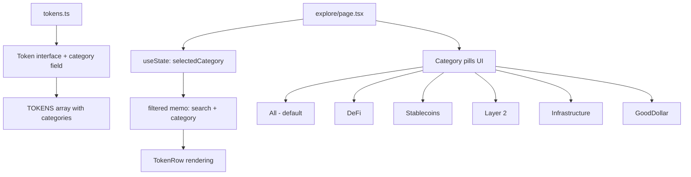

## Problem Statement

CoinGecko provides extensive category filter tabs (All, Highlights, Base Ecosystem, Categories, Derivatives, Solana Meme, DEX) that allow users to quickly browse tokens by ecosystem or use case. Our Explore page has a search box but no category-based filtering. With 18 tokens in the listing, a user looking for "just the stablecoins" or "just the DeFi tokens" has to scan the entire table or type individual names. As the token list grows, lack of filtering will become increasingly painful.

## User Story

As a DeFi user browsing tokens on GoodDollar, I want to filter the token table by category (e.g., DeFi, Stablecoins, Layer 2) so that I can quickly find the type of tokens I'm interested in without scrolling through the entire list.

## How It Was Found

Side-by-side comparison of our Explore page vs CoinGecko. CoinGecko has a horizontal tab bar with category filters. Our Explore page only has search and column sorting. While our search is functional, it doesn't support discovery — a user who doesn't know what they're looking for can't browse by category.

## Proposed UX

Add a horizontal scrollable pill/tab bar between the search box and the table. Categories:
- **All** (default — shows everything)
- **DeFi** (AAVE, UNI, MKR, COMP, CRV, SNX, LDO)
- **Stablecoins** (USDT, USDC, DAI)
- **Layer 2** (ARB, OP, MATIC)
- **Infrastructure** (LINK, WETH, WBTC)
- **GoodDollar** (G$)

Style should match the existing category pills on the Predict page — small rounded buttons with active state highlight in goodgreen.

Add a `category` field to the token data and filter the table based on the selected category.

## Acceptance Criteria

- [ ] A horizontal pill bar appears between the search box and the token table
- [ ] Categories include: All, DeFi, Stablecoins, Layer 2, Infrastructure, GoodDollar
- [ ] Clicking a category filters the token table to show only tokens in that category
- [ ] "All" is selected by default and shows all tokens
- [ ] Category filter works in combination with the search box
- [ ] Active category pill is highlighted with goodgreen styling
- [ ] Pills are horizontally scrollable on mobile
- [ ] All existing tests pass

## Verification

- Run `npx vitest run` — all tests pass
- Open /explore — category tabs visible between search and table
- Click each category — table filters correctly
- Combine category with search — both filters applied
- Check mobile — pills scroll horizontally

## Out of Scope

- Adding new tokens to the listing
- Multi-select categories
- Saving category preference

---

## Planning

### Overview

Add a horizontal pill bar of category filters to the Explore page, positioned between the search box and the token table. Each token gets a `category` field. Filtering is additive with the existing search — both can be applied simultaneously.

### Research Notes

- Tokens are defined in `src/lib/tokens.ts` — the `Token` interface needs a `category` field.
- Market data extends Token via `TokenMarketData` in `src/lib/marketData.ts` — category will flow through automatically.
- The Explore page at `src/app/explore/page.tsx` already has `filtered` memo for search — category filter adds another predicate.
- The Predict page already uses a very similar category pill pattern (see `predict/page.tsx` lines 169-185) — we should match that styling.
- Category assignments:
  - **DeFi**: AAVE, UNI, MKR, COMP, CRV, SNX, LDO
  - **Stablecoins**: USDT, USDC, DAI
  - **Layer 2**: ARB, OP, MATIC
  - **Infrastructure**: LINK, WETH, WBTC, ETH
  - **GoodDollar**: G$

### Architecture Diagram

### One-Week Decision

**YES** — Adding a category field to token data and a filter row to the explore page is ~1-2 hours. Same pill pattern already exists on the Predict page.

### Implementation Plan

1. Add `category?: string` to the `Token` interface in `src/lib/tokens.ts`
2. Assign categories to each token in the `TOKENS` array
3. Export a `TOKEN_CATEGORIES` array from `tokens.ts`
4. In `src/app/explore/page.tsx`, add `selectedCategory` state and update the `filtered` memo to apply category filtering
5. Render a horizontal pill bar between the search input and the table, styled like the Predict page category pills
6. Ensure "All" is selected by default
7. Test that category + search work together
