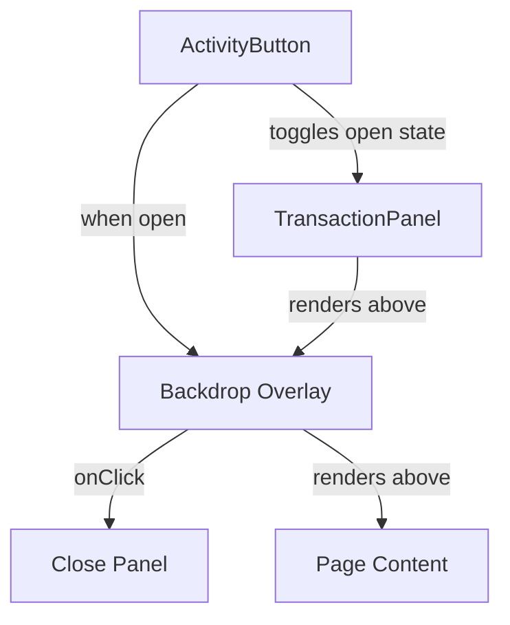

## Problem Statement

The "Recent Activity" dropdown panel (activated by the clock icon button in the header) opens directly over page content without any backdrop overlay to dim the background. On the homepage, the hero text ("Trade. Predict. Invest. Fund UBI.") is visible around and adjacent to the dropdown panel, creating visual clutter and making it harder to focus on the panel's content. While the panel itself has an opaque background (`bg-dark-100`), the surrounding page content remains at full brightness, reducing the visual hierarchy.

## User Story

As a user, I want the Recent Activity dropdown to dim the background when opened so that I can focus on my recent activity without visual distraction from the page content.

## How It Was Found

During a surface sweep, the "Recent Activity" clock icon button was clicked on the homepage. The dropdown appeared in the upper right but the hero text and page content remained at full brightness around it, creating visual clutter. Modern dropdown panels use a subtle backdrop to focus user attention.

## Proposed UX

- Add a subtle semi-transparent backdrop overlay behind the dropdown (but above page content) when the panel is open.
- Clicking the backdrop should close the panel (same as clicking outside).
- The backdrop should have a smooth fade-in/out transition.
- The panel itself already has proper bg/shadow/z-index — just needs the backdrop.

## Architecture

## One-Week Decision

**YES** — This is a CSS/React change to add a backdrop div in `ActivityButton.tsx`. Takes ~30 minutes.

## Implementation Plan

1. In `ActivityButton.tsx`, when `open` is true, render a fixed-position backdrop div before the `TransactionPanel`.
2. The backdrop should be `fixed inset-0 bg-black/20 z-40` (below panel's z-50).
3. Clicking the backdrop calls `setOpen(false)`.
4. Add fade-in animation using tailwind `animate-in fade-in`.
5. Ensure the existing click-outside handler still works.

## Acceptance Criteria

- [ ] A semi-transparent backdrop overlay appears when the Recent Activity dropdown opens
- [ ] Clicking the backdrop closes the dropdown
- [ ] Backdrop fades in smoothly
- [ ] Panel remains above the backdrop (z-50 vs z-40)
- [ ] No regression on existing click-outside and Escape key behavior
- [ ] All existing tests continue to pass

## Verification

- Run all tests and verify in browser with agent-browser
- Take a screenshot of the open dropdown and verify backdrop dims background

## Out of Scope

- Changing the dropdown's content or functionality
- Adding real transaction data
- Redesigning the dropdown layout
