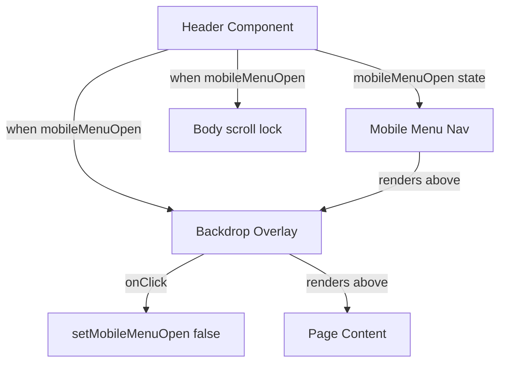

## Problem Statement

When the hamburger menu is opened on mobile viewports (< 768px), the navigation links appear in a dropdown panel but the page content behind remains fully visible, scrollable, and interactive. There is no backdrop overlay to indicate that a modal-like UI element is open. This creates a confusing UX where users may accidentally interact with page elements behind the menu.

## User Story

As a mobile user, I want the navigation menu to have a backdrop overlay when opened so that I can focus on the menu items without accidentally interacting with page content behind it.

## How It Was Found

During a surface sweep on mobile viewport (375x812), the hamburger menu button was tapped. The menu opens and shows navigation links (Swap, Explore, Pool, Bridge, Stocks, Predict, Perps, Portfolio), but the page hero section, UBI banner, and swap card are all fully visible and scrollable behind the menu items.

## Proposed UX

- When the mobile menu is opened, a semi-transparent dark backdrop overlay should appear behind the menu but above the page content (similar to how modals work).
- Tapping the backdrop should close the menu (same as tapping the X button).
- The page should stop scrolling when the menu is open (scroll lock on body).
- The backdrop should have a smooth fade-in animation matching the menu slide-in.

## Acceptance Criteria

- [ ] A dark semi-transparent backdrop appears when the mobile menu opens (e.g., `bg-black/50`)
- [ ] Page content behind the menu is not interactive while the menu is open
- [ ] Tapping the backdrop closes the menu
- [ ] Body scroll is locked when the menu is open
- [ ] Backdrop has a smooth fade-in/fade-out transition
- [ ] No regression on desktop navigation (backdrop only appears on mobile)
- [ ] All existing tests continue to pass

## Architecture

## One-Week Decision

**YES** — This is a CSS/React change in `Header.tsx`. Takes ~30 minutes.

## Implementation Plan

1. In `Header.tsx`, when `mobileMenuOpen` is true, render a fixed-position backdrop div before the mobile menu content.
2. The backdrop should be `fixed inset-0 bg-black/50 z-40 sm:hidden` (only on mobile).
3. Clicking the backdrop calls `setMobileMenuOpen(false)`.
4. Add body scroll lock via `useEffect` — set `document.body.style.overflow = 'hidden'` when menu is open, restore on close.
5. Add fade-in animation using tailwind `animate-in fade-in`.
6. Ensure the existing click-outside handler still works (the backdrop click now handles outside clicks).

## Verification

- Run all tests and verify in browser with agent-browser on mobile viewport
- Take a screenshot showing the backdrop overlay

## Out of Scope

- Redesigning the mobile menu layout or adding new navigation items
- Desktop navigation changes
- Animation of menu items (slide-in effects beyond basic transition)
