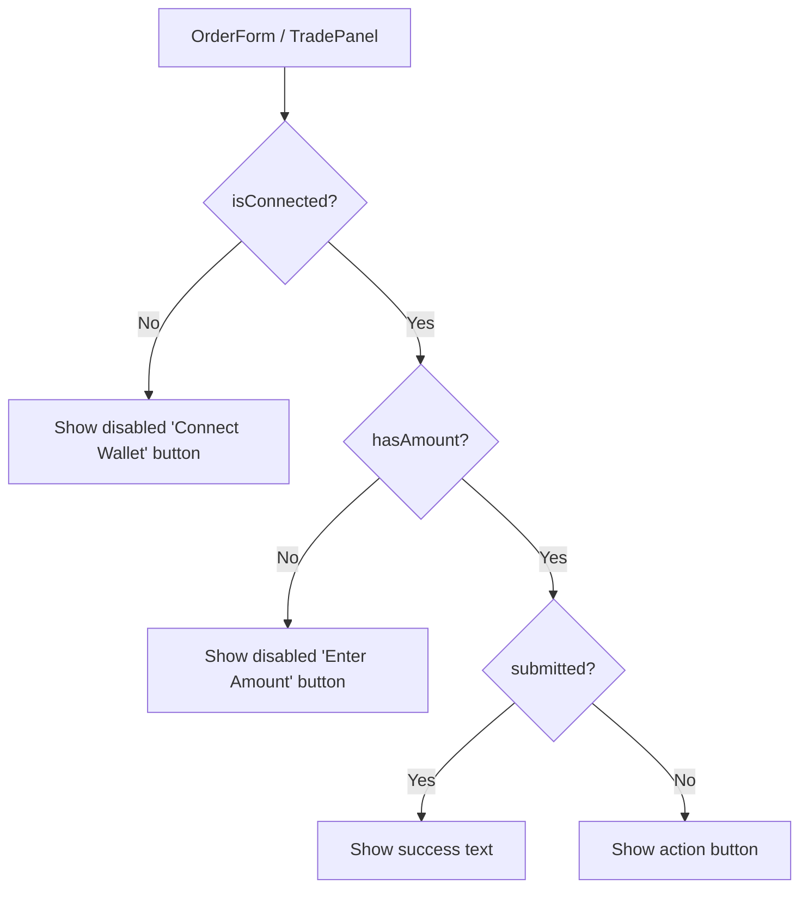

## Overview

Add wallet-connection gating to all three trading forms (Stocks, Predict, Perps) so they match the existing Swap page pattern. Each form's submit button should show "Connect Wallet" when no wallet is connected, "Enter Amount" when connected but no amount entered, and the action text only when ready to trade.

## Research Notes

- `SwapWalletActions.tsx` (lines 181-187) already implements the correct pattern using `useAccount()` from wagmi
- `ConnectWalletEmptyState.tsx` uses `useAccount()` + `useConnectModal()` from rainbowkit for full-page empty states
- The `useWalletReady()` hook from `WalletReadyContext` is used to prevent SSR hydration mismatches — forms should use the same pattern
- All three affected components are client components (`'use client'`) so wagmi hooks work directly
- The `handleSubmit` functions in all three forms already check `parseFloat(amount) > 0` — adding `isConnected` check is a one-line addition

## Architecture Diagram

## One-Week Decision

**YES** — This is a ~2 hour task. Three small edits to three files, each adding the same `useAccount()` check.

## Implementation Plan

### Phase 1: Add wallet check to each form

For each of the three files:
1. Import `useAccount` from `wagmi` and `useWalletReady` from `@/lib/WalletReadyContext`
2. Get `isConnected` from `useAccount()`
3. Get `walletReady` from `useWalletReady()` 
4. Guard the `handleSubmit` function: add `if (!isConnected) return` at the top
5. Replace the submit button rendering with a conditional chain (same as SwapWalletActions):
   - If not connected: disabled "Connect Wallet" button
   - If no amount: disabled "Enter Amount" button  
   - If connected + amount: show action button

### Phase 2: Update tests

Add/update tests to verify the button states for connected vs disconnected.

## Problem Statement

Across all three trading sections (Stocks, Predict, Perps), users can enter trade amounts and click the submit button **without a connected wallet**. The buttons then display fake success messages ("Order Placed!" / "Order Submitted!") as if the trade executed, even though no wallet is connected and no transaction happened. This creates a misleading UX where users may believe their orders went through.

The Swap page already handles this correctly — it shows a disabled "Connect Wallet to Swap" button that clearly communicates the wallet requirement. The other three trading sections should follow the same pattern.

**Affected pages:**
- `/stocks/[ticker]` — "Buy [TICKER]" button becomes "Order Submitted!" without wallet
- `/predict/[marketId]` — "Buy YES" button becomes "Order Placed!" without wallet
- `/perps` — "Long BTC" button becomes "Order Placed!" without wallet (when order size is within fake margin)

## User Story

As a new user exploring the platform without a wallet connected, I want trading buttons to clearly tell me I need to connect a wallet so that I don't mistakenly believe my orders were placed successfully.

## How It Was Found

During error-handling review with agent-browser:
1. Navigated to `/stocks/AAPL`, entered 500 in amount, clicked "Buy AAPL" — button changed to "Order Submitted!" with no wallet connected
2. Navigated to `/predict/us-election-2028`, entered 100 in amount, clicked "Buy YES" — button changed to "Order Placed!" with no wallet connected
3. Navigated to `/perps`, entered 0.1 BTC size, clicked "Long BTC" — button changed to "Order Placed!" with no wallet connected

In all three cases, the header still showed "Connect Wallet" in the top-right, confirming no wallet was connected.

## Proposed UX

Follow the existing Swap page pattern:
- When **no wallet connected**: Show a disabled button with text "Connect Wallet to Trade" (or section-specific: "Connect Wallet to Buy", "Connect Wallet to Long")
- When **wallet connected but amount is 0**: Show disabled button with "Enter Amount"
- When **wallet connected and amount valid**: Show the action button ("Buy AAPL", "Buy YES", "Long BTC")
- Never show "Order Placed!" / "Order Submitted!" unless a real transaction was initiated

## Acceptance Criteria

- [ ] Stock detail trade panel shows "Connect Wallet" button (disabled) when no wallet is connected
- [ ] Predict market trade panel shows "Connect Wallet" button (disabled) when no wallet is connected
- [ ] Perps trade panel shows "Connect Wallet" button (disabled) when no wallet is connected
- [ ] None of the three sections can show "Order Placed!" / "Order Submitted!" without a wallet connection
- [ ] When wallet IS connected, the existing flow works as before (button shows action, simulates success)
- [ ] Button text changes based on state: no wallet → "Connect Wallet", no amount → "Enter Amount", valid → action text

## Verification

- Run all tests: `npx vitest run`
- Verify in browser with agent-browser: navigate to each trading page without a wallet and confirm buttons show "Connect Wallet" text
- Verify buttons are disabled when no wallet is connected

## Out of Scope

- Actually implementing real wallet transaction logic (these are still demo/mock trades)
- Changing the Swap page behavior (it already works correctly)
- Adding wallet connection modal triggers (just show the correct button state)
