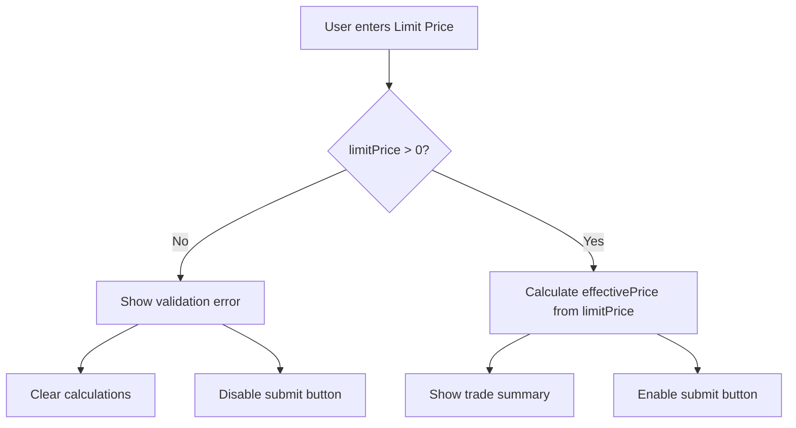

## Problem Statement

The Perps and Stocks limit order forms accept a limit price of **0**, producing nonsensical trade calculations that would confuse users:

- **Perps**: Setting Limit Price to 0 with Size 1 BTC shows Notional: $60,125.80, Margin: $6,012.58, and Liq. Price: $54,714.48 — all calculated from the mark price instead of the limit price. A limit buy at $0 should not produce these figures.
- **Stocks**: Setting Limit Price to 0 with Amount $1,000,000 shows Est. Shares: 0.0000 AAPL, Price: $0.00, but Fee (0.1%): $1K — charging a fee on a trade that would buy zero shares.

Both forms also accept negative values for the limit price input (the minus sign is stripped but no explicit validation message is shown).

## User Story

As a trader, I want the limit order form to reject invalid prices (zero, negative) so that I don't see confusing or impossible trade calculations.

## How It Was Found

Tested in the browser (agent-browser) by:
1. Opening `/perps`, switching to Limit order type, entering 0 as the Limit Price and 1 as Size
2. Opening `/stocks/AAPL`, switching to Limit order type, entering 0 as the Limit Price and 1000000 as Amount
3. Both accepted the values and showed misleading calculations

## Proposed UX

- Show inline validation error "Price must be greater than 0" when the user enters 0 or a negative number in the Limit Price field
- Disable the submit/trade button when limit price is invalid
- Clear the trade summary calculations (notional, margin, liq. price, shares, fee) when limit price is 0 or empty — don't show misleading numbers based on mark price

## Acceptance Criteria

- [ ] Perps limit order form shows validation error when limit price is 0 or negative
- [ ] Stocks limit order form shows validation error when limit price is 0 or negative
- [ ] Trade summary calculations are not shown when limit price is invalid
- [ ] Submit button remains disabled when limit price is invalid
- [ ] Valid positive limit prices still work correctly
- [ ] Perps Stop-Limit order type also validates the stop price and limit price fields

## Research Notes

- Perps limit price form is in `frontend/src/app/perps/page.tsx`, `OrderForm` component (line ~172)
- Stocks limit price form is in `frontend/src/app/stocks/[ticker]/page.tsx`, `OrderForm` component (line ~46)
- Both use `sanitizeNumericInput` from `@/lib/format.ts` which strips non-numeric characters but has no minimum value check
- Both use `effectivePrice` that falls back to mark price when limit price is 0/empty — this is why calculations look wrong
- The perps `effectivePrice` is: `orderType === 'market' ? pair.markPrice : (parseFloat(limitPrice) || pair.markPrice)`
- The stocks `effectivePrice` is: `orderType === 'limit' && limitPrice ? parseFloat(limitPrice) : stock.price`
- The `||` fallback to mark price causes the misleading calculations when limit price is 0

## Architecture

## One-Week Decision

**YES** — This is a straightforward validation addition to two existing components. Less than 1 day of work.

## Implementation Plan

### Phase 1: Add validation to Perps OrderForm
1. Add a computed `limitPriceError` that checks if limit price is entered and <= 0
2. Show inline error message below the limit price input when invalid
3. Disable the submit button when `limitPriceError` is truthy
4. Change `effectivePrice` to NOT fall back to mark price when limit price is 0 — instead, return 0, and conditionally hide the calculations

### Phase 2: Add validation to Stocks OrderForm
1. Same approach as Perps — add `limitPriceError` computed value
2. Show inline error message
3. Disable submit button when invalid
4. Fix `effectivePrice` fallback

### Phase 3: Add validation to Perps Stop-Limit trigger price
1. Also validate triggerPrice > 0 for stop-limit orders

## Verification

- Run all tests and verify in browser with agent-browser

## Out of Scope

- Validating that limit price is within a reasonable range of mark price (e.g., within 50%)
- Server-side validation (this is frontend-only)
