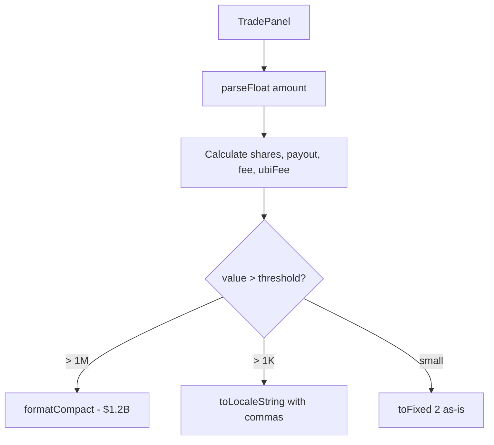

## Problem Statement

When entering large amounts in the Predict market detail trade panel (e.g., $99,999,999,999), the calculated values display as raw unformatted numbers:

- Est. Shares: `20833333331.3` (no commas, no abbreviation)
- Potential Payout: `$208333333331.25` (no commas, no abbreviation)
- Fee (1%): `$999999999.99` (no commas)
- UBI Pool (33%): `$330000000.00` (no commas)

These raw numbers are nearly impossible to read at a glance. By comparison, the Perps trading panel formats large values with abbreviations like "$60.1T", "$6.01T", "$30.1B" which is much more readable.

## User Story

As a prediction market trader, I want the trade summary numbers to be formatted with commas and/or abbreviations (K, M, B, T) so that I can quickly understand the magnitude of my trade.

## How It Was Found

Tested in the browser (agent-browser) by:
1. Opening `/predict/us-election-2028`
2. Entering `99999999999` in the Amount (USD) field
3. Observing that Est. Shares, Potential Payout, Fee, and UBI Pool display raw unformatted numbers

## Proposed UX

- Format all monetary values with commas for readability (e.g., `$999,999,999.99`)
- For values exceeding $1M, abbreviate with K/M/B/T suffixes (e.g., `$1.00B` instead of `$999,999,999.99`)
- Format share counts similarly (e.g., `20.8B shares` instead of `20833333331.3`)
- Match the formatting approach already used in the Perps panel and Explore page

## Acceptance Criteria

- [ ] Est. Shares value is formatted with commas or abbreviated for large numbers
- [ ] Potential Payout is formatted with commas or abbreviated (matching perps panel style)
- [ ] Fee amount is formatted with commas or abbreviated
- [ ] UBI Pool amount is formatted with commas or abbreviated
- [ ] Small values (under $1,000) still show exact decimal amounts
- [ ] Numbers stay within the panel bounds without overflow

## Research Notes

- Trade panel is in `frontend/src/app/predict/[marketId]/page.tsx`, `TradePanel` component (line ~44)
- Currently uses `.toFixed(1)` for shares, `.toFixed(2)` for dollar values — no thousand separators or abbreviation
- The app already has `formatVolume` in `@/lib/predictData.ts` that abbreviates volumes (used in market stats grid)
- The app also has `formatLargeNumber` in `@/lib/stockData.ts` used for stock summary
- The perps panel uses `formatCompact` from `@/lib/format.ts` for large values ($60.1T, $30.1B etc.)
- Best approach: reuse existing formatting utilities from `@/lib/format.ts`

## Architecture

## One-Week Decision

**YES** — Simple formatting change in one file. Less than half a day of work.

## Implementation Plan

1. Check if `formatCompact` or similar exists in `@/lib/format.ts` — reuse it
2. If not, create a `formatTradeValue` helper that:
   - For values >= 1T: format as "$X.XXT"
   - For values >= 1B: format as "$X.XXB"
   - For values >= 1M: format as "$X.XXM"
   - For values >= 1K: format as "$X.XXK"
   - Otherwise: use `.toLocaleString()` with 2 decimal places
3. Apply this formatter to all 4 trade summary values in the TradePanel:
   - Est. Shares
   - Potential Payout
   - Fee (1%)
   - UBI Pool (33%)

## Verification

- Run all tests and verify in browser with agent-browser

## Out of Scope

- Changing the max amount users can enter (no cap needed)
- Adding max amount validation
- Reformatting numbers in other parts of the app (focus only on predict trade panel)
