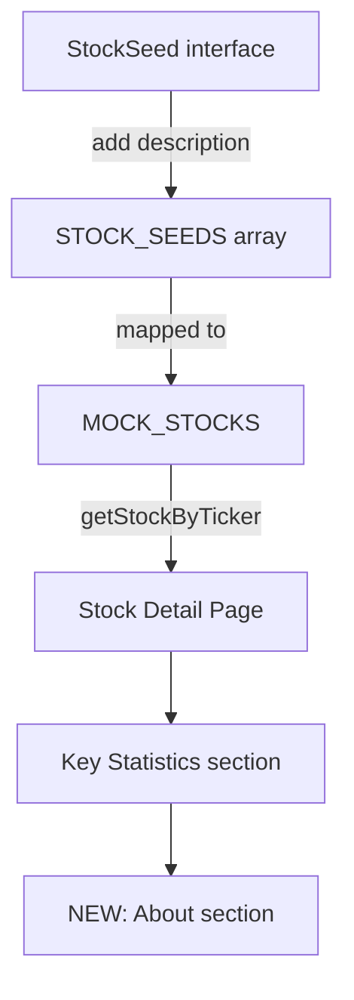

## Problem Statement

The stock detail page (e.g., `/stocks/MSFT`) shows a price chart, trading panel, position info, and key statistics — but there is no description of what the company does. For a user researching a stock before investing, especially a less familiar company like DIS (Walt Disney) or AMD, they have no way to understand the company's business without leaving the platform.

Yahoo Finance, TradingView, and Robinhood all show company descriptions on their stock detail pages because investors need context beyond just numbers.

## User Story

As an investor researching stocks on GoodDollar, I want to see a brief description of what each company does on the stock detail page, so that I can make informed decisions without needing to search elsewhere.

## How It Was Found

User journey test: "User researches a stock and compares it"
1. Navigated to `/stocks`
2. Clicked MSFT row → navigated to `/stocks/MSFT`
3. Scrolled through the detail page — saw price chart, trading panel, "Your Position", and "Key Statistics"
4. No company description, industry overview, or "About" section anywhere on the page
5. For a user unfamiliar with a stock like NFLX or AMD, there's no way to understand what the company does

## Proposed UX

Add an "About" section below the Key Statistics panel on the stock detail page:
- Company name and sector tag
- 2-3 sentence description of the company's business
- Located between Key Statistics and the footer
- Collapsible on mobile to save space

The descriptions should be stored alongside existing stock mock data in `stockData.ts`.

## Acceptance Criteria

- [ ] Stock detail page shows an "About" section with company description
- [ ] Each of the 12 stocks has a meaningful 2-3 sentence description
- [ ] Description section shows below Key Statistics
- [ ] Section is styled consistently with the rest of the detail page (dark card, same border/radius)
- [ ] Renders correctly on mobile without layout issues

## Research Notes

- Stock data is in `frontend/src/lib/stockData.ts`, defined via `StockSeed` interface and `STOCK_SEEDS` array
- Stock detail page is at `frontend/src/app/stocks/[ticker]/page.tsx`
- `Stock` interface has: ticker, name, sector, price, change24h, volume24h, marketCap, high52w, low52w, sparkline7d, peRatio, eps, dividendYield, avgVolume
- Need to add `description: string` to both `StockSeed` and `Stock` interfaces
- The Key Statistics section is at lines 217-263 in the stock detail page — add About section after it
- 12 stocks total: AAPL, TSLA, NVDA, MSFT, AMZN, GOOGL, META, JPM, V, DIS, NFLX, AMD

## Architecture

## One-Week Decision

**YES** — Adding a field to mock data and a new section to one page. Half a day of work.

## Implementation Plan

1. Add `description: string` to `StockSeed` interface in `stockData.ts`
2. Write 2-3 sentence descriptions for all 12 stocks in `STOCK_SEEDS`
3. Add `description` to the `Stock` interface
4. Add an "About" card section below Key Statistics in `stocks/[ticker]/page.tsx`

## Verification

- Run all tests and verify in browser with agent-browser

## Out of Scope

- Real company data from external APIs
- Earnings reports or financial statements
- News feed or press releases
- Links to external company websites
