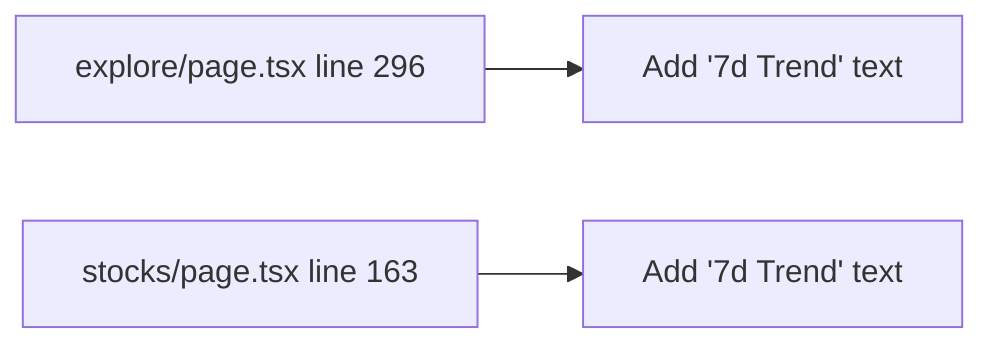

## Problem Statement

Both the Explore token table and the Stocks table display a 7-day sparkline chart in a column at the right side of the table, but neither table has a visible column header label for that column. The `<th>` elements are empty (Explore has no content at all; Stocks has only an `aria-label`). This creates an incomplete table header row where the sparkline column looks like an unlabeled appendage, reducing visual professionalism.

Similarly, both tables have an action button column (Swap on Explore, Trade on Stocks) with no visible header.

## User Story

As a user browsing the Explore or Stocks table, I want every column to have a visible header label, so that the table looks complete and I can immediately understand what each column represents.

## How It Was Found

Visual review of the Explore page at `http://localhost:3100/explore` and Stocks page at `http://localhost:3100/stocks`. The table header row shows: #, Token, Price, 1h, 24h, 7d, Volume, Market Cap — then a blank column (sparkline) followed by another blank column (action button). The sparkline charts render in the cells but the header row has empty `<th>` elements.

In `frontend/src/app/explore/page.tsx` line 296: `<th className="py-3 px-2 hidden lg:table-cell" />` — empty sparkline header.
In `frontend/src/app/stocks/page.tsx` line 163: `<th className="py-3 px-2 hidden lg:table-cell" aria-label="7-day trend" />` — has aria-label but no visible text.

## Proposed UX

Add small, muted header text:
- Sparkline column: "7d Trend" in the same text-gray-400 styling as other headers
- Action column: leave empty (action columns conventionally have no header) — OR add a thin empty header with a fixed width

The header text should be small and unobtrusive since the sparkline column is a visual supplement, not a sortable data column.

## Acceptance Criteria

- [ ] Explore table sparkline column has a visible "7d Trend" header label
- [ ] Stocks table sparkline column has a visible "7d Trend" header label
- [ ] Header text uses consistent styling with other column headers (text-gray-400, font-semibold)
- [ ] Header is hidden on smaller viewports where the sparkline column is hidden (lg:table-cell)
- [ ] No layout shift or column width changes

## Research Notes

- Explore table headers defined at `frontend/src/app/explore/page.tsx` lines 256-299
- Stocks table headers defined at `frontend/src/app/stocks/page.tsx` lines 147-166
- Sparkline header in Explore (line 296): `<th className="py-3 px-2 hidden lg:table-cell" />` — completely empty
- Sparkline header in Stocks (line 163): `<th className="py-3 px-2 hidden lg:table-cell" aria-label="7-day trend" />` — has aria-label but no visible text
- Both use `hidden lg:table-cell` to hide on smaller screens, matching the sparkline data cells
- Other headers use `text-gray-400 font-semibold` text styling

## Architecture

## One-Week Decision

**YES** — Two single-line changes adding text to empty `<th>` elements. Under 15 minutes of work.

## Implementation Plan

1. In `frontend/src/app/explore/page.tsx`, add "7d Trend" text to the empty sparkline `<th>` at line 296
2. In `frontend/src/app/stocks/page.tsx`, add "7d Trend" text to the sparkline `<th>` at line 163
3. Both should use the same text styling as adjacent column headers

## Verification

- Run all tests and verify in browser with agent-browser

## Out of Scope

- Making the sparkline column sortable
- Changing sparkline chart styling
- Adding headers to action button columns
