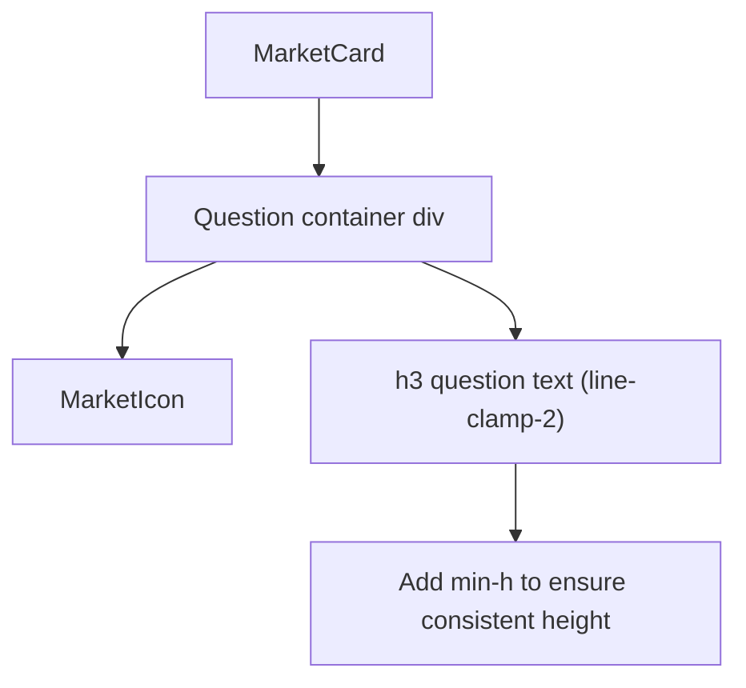

## Problem Statement

On the Predict markets page, the three active market cards are displayed in a 3-column grid. Each card has a question title area (using `line-clamp-2`) followed by a probability percentage, progress bar, Yes/No buttons, and volume/liquidity stats. Because different questions have different text lengths (e.g., "Will AGI be achieved by 2030?" is 1 line while "Will the Democratic candidate win the 2028 US Presidential Election?" is 2 lines), the probability bars and Yes/No buttons start at different vertical positions across the row.

This creates visual unevenness in the card grid — the cards don't align horizontally, making the layout look unprofessional compared to apps like Polymarket where cards in a row are visually balanced.

## User Story

As a user browsing prediction markets, I want all market cards in a row to have their probability bars and action buttons aligned at the same vertical position, so the grid looks clean and consistent.

## How It Was Found

Visual review of the Predict page at `http://localhost:3100/predict`. The three active market cards have:
- Card 1: 2-line question → probability bar starts lower
- Card 2: 1-line question → probability bar starts higher
- Card 3: 2-line question → probability bar starts lower

The container div for the question area (`flex items-start gap-3 mb-3` at line 137 of `predict/page.tsx`) has no minimum height, so it shrinks to fit the content.

## Proposed UX

Add a `min-h-[3rem]` (or similar appropriate value) to the question area container to ensure all cards have consistent height for the question section, regardless of text length. This forces the probability bar and everything below it to start at the same vertical position.

## Acceptance Criteria

- [ ] All market cards in the same row have their probability bars aligned at the same vertical position
- [ ] Cards with 1-line questions have extra whitespace below the question text to match 2-line cards
- [ ] Cards with 2-line questions (the maximum from line-clamp-2) are not affected
- [ ] The min-height works correctly on all viewport sizes (mobile 1-col, tablet 2-col, desktop 3-col)
- [ ] No visual regression on expired market cards

## Research Notes

- MarketCard component defined at `frontend/src/app/predict/page.tsx` lines 95-184
- Question area container at line 137: `
`
- Question text at line 139: `<h3 className="text-sm font-semibold text-white leading-snug group-hover:text-goodgreen/90 transition-colors line-clamp-2">`
- `line-clamp-2` limits text to 2 lines max
- At text-sm (14px) with leading-snug (1.375), 2 lines = ~38.5px. A `min-h-[2.75rem]` (44px) on the container or `min-h-[2.5rem]` (40px) on the h3 would ensure consistency
- The MarketIcon component adds ~24px height alongside the text

## Architecture

## One-Week Decision

**YES** — Single CSS class addition. Under 15 minutes of work.

## Implementation Plan

1. Add `min-h-[2.75rem]` to the question container div at line 137 of `predict/page.tsx` to ensure the question area always takes at least 2 lines of height
2. Verify alignment across cards with different question lengths

## Verification

- Run all tests and verify in browser with agent-browser

## Out of Scope

- Changing the card layout structure
- Modifying the line-clamp limit
- Redesigning the market card component
