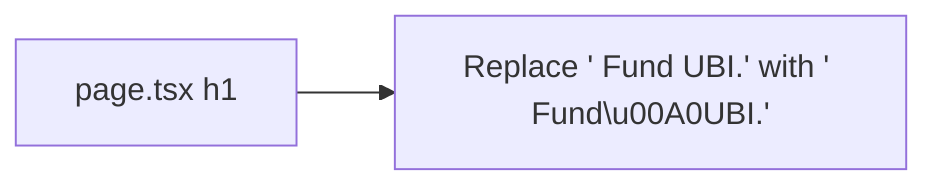

## Problem Statement

The homepage hero headline reads "Trade. Predict. Invest. Fund UBI." At the current `max-w-md` (448px) container width with `text-2xl sm:text-3xl` font size, the text wraps to place "UBI." alone on its own line. This creates an orphaned word — a single short word on the last line of a heading — which is a well-known typography anti-pattern that makes text look poorly formatted.

The wrap appears as:
```
Trade. Predict. Invest. Fund
UBI.
```

Instead of a more balanced:
```
Trade. Predict. Invest.
Fund UBI.
```

## User Story

As a first-time visitor to GoodDollar, I want the hero headline to look typographically polished, so the landing page creates a professional first impression.

## How It Was Found

Visual review of the homepage at `http://localhost:3100/` on a 1440×900 viewport. The h1 element at `frontend/src/app/page.tsx` line 32-34 wraps "UBI." to a separate line due to the combination of container width and font size.

## Proposed UX

Use a non-breaking space (`\u00A0`) between "Fund" and "UBI." so they always stay on the same line: `Trade. Predict. Invest. Fund\u00A0UBI.`

This ensures the text wraps as:
```
Trade. Predict. Invest.
Fund UBI.
```

Which is more balanced and avoids the orphan.

## Acceptance Criteria

- [ ] The words "Fund" and "UBI." always appear on the same line of the hero heading
- [ ] The text wraps naturally at other points without forcing a specific layout
- [ ] No visual regression on mobile viewports (375px)
- [ ] No visual regression on large viewports (1440px+)

## Research Notes

- Hero heading at `frontend/src/app/page.tsx` lines 32-34
- Current text: `Trade. Predict. Invest. Fund UBI.`
- Container: `max-w-md` (448px)
- Font: `text-2xl sm:text-3xl font-bold`
- Using `\u00A0` (non-breaking space) between "Fund" and "UBI." is the standard web typography fix for orphans
- Alternative: use `<span className="whitespace-nowrap">Fund&nbsp;UBI.</span>` for explicit control

## Architecture



## One-Week Decision

**YES** — Single character change. Under 5 minutes of work.

## Implementation Plan

1. In `frontend/src/app/page.tsx` line 33, replace the space between "Fund" and "UBI." with a non-breaking space character (`\u00A0`)

## Verification

- Run all tests and verify in browser with agent-browser at multiple viewports

## Out of Scope

- Changing the heading text content
- Adjusting font sizes or container widths
- Adding animation to the heading
