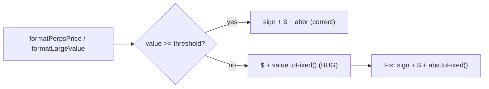

## Problem Statement

The `formatPerpsPrice` and `formatLargeValue` functions in `frontend/src/lib/perpsData.ts` display negative dollar values as "$-8.06" instead of the standard "-$8.06". This occurs for all negative values below $1,000 because the functions use `price` (negative) directly in template literals with a leading `$`, rather than using the absolute value with a prepended sign.

Affected locations observed in the browser:
- **Perps Portfolio**: Net Funding card displays "$-8.06"
- **Funding tab**: Negative amounts show "$-2.55", "$-1.87", "$-2.42", "$-1.73"
- **Account panel**: Unrealized P&L would display incorrectly when negative
- **Trade history**: Any closed-position negative P&L

## User Story

As a perps trader, I want negative dollar values to display as "-$8.06" (not "$-8.06"), so that monetary values follow standard US dollar formatting conventions and look professional.

## How It Was Found

Visual inspection of the Perps Portfolio page in the browser. The Net Funding summary card shows "$-8.06" and the Funding tab shows "$-2.55", "$-1.87", etc. Confirmed by reading `formatPerpsPrice` (lines 181–184) and `formatLargeValue` (line 198) in `perpsData.ts`.

## Proposed UX

All negative dollar values should display with the minus sign before the dollar sign: "-$8.06", "-$2.55", etc. Positive values with a "+" prefix should remain "+$435.69" (already correct).

## Acceptance Criteria

- [ ] `formatPerpsPrice(−8.06)` returns `"-$8.06"` (not `"$-8.06"`)
- [ ] `formatPerpsPrice(−0.005)` returns `"-$0.0050"` (not `"$-0.0050"`)
- [ ] `formatLargeValue(−1500)` returns `"-$2K"` (not `"$-2K"`)
- [ ] Perps Portfolio Net Funding card displays "-$8.06"
- [ ] Funding tab amounts display "-$2.55", "-$1.87", etc.
- [ ] No regressions in positive value formatting

## Verification

- Run all tests
- Open /perps/portfolio in the browser, check Net Funding card and Funding tab for correct negative formatting

## Out of Scope

- Adding new formatting functions
- Changing positive value formatting
- Any non-perps formatting changes (unless the same functions are used elsewhere)

---

## Planning

### Overview

Two formatting functions in `frontend/src/lib/perpsData.ts` produce incorrect negative dollar formatting. For values below $1,000 (i.e. not hitting the abbreviation tiers), the functions use `price` directly in the template literal `$${price.toFixed(2)}`, which for negative values produces `$-8.06`.

### Research Notes

- `formatPerpsPrice` lines 181–184: Uses raw `price` (negative) instead of `abs` for values < $1M
- `formatLargeValue` line 198: Same issue for values < $1K
- Lines 174–178 (abbreviation path) correctly use `${sign}$${abbr}` — only the fallback paths are broken

### Assumptions

- The fix should use the same `sign` + `abs` pattern already used in the abbreviation path

### Architecture Diagram

### One-Week Decision

**YES** — This is a 15-minute fix: change 4 lines to use `${sign}$${abs.toFixed(...)}` instead of `$${price.toFixed(...)}`.

### Implementation Plan

1. Fix `formatPerpsPrice` lines 181–184 to use `${sign}$${abs...}` pattern
2. Fix `formatLargeValue` line 198 similarly
3. Verify in browser: /perps/portfolio Net Funding and Funding tab
