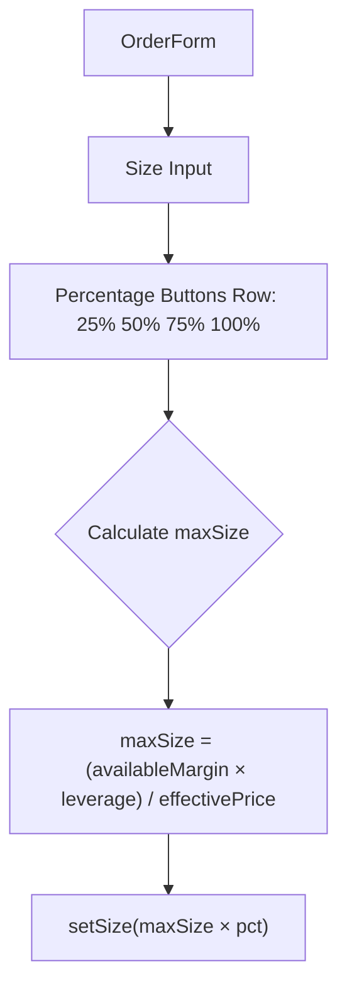

## Problem Statement

The Perps order form requires users to manually calculate how much of their available margin to use for a trade. Every major perps platform (Hyperliquid, Bybit, Binance Futures) provides quick-fill percentage buttons (25%, 50%, 75%, 100%) next to the size input that automatically calculate and fill the position size based on available margin and current leverage.

Without these buttons, users must:
1. Check their available margin ($7,285.32)
2. Mentally multiply by leverage (10x = $72,853.20 buying power)
3. Divide by the current price ($60,125.80) to get size in base asset (1.21 BTC)
4. Manually type the result

This is tedious, error-prone, and a significant UX gap vs competition.

## User Story

As a perps trader, I want quick percentage buttons next to the size input, so that I can quickly set my position size to 25%, 50%, 75%, or 100% of my available buying power without manual calculation.

## How It Was Found

Tested the Perps order form end-to-end in the browser. Entered a size of 0.5 BTC, saw the order summary, and noticed there are no percentage buttons. Compared to Hyperliquid which has these buttons as a standard feature.

## Proposed UX

Add a row of four buttons (25%, 50%, 75%, 100%) directly below the Size input field. When clicked:
- Calculate max size = (available margin × leverage) / effective price
- Fill the size input with the corresponding percentage of max size
- Round to a reasonable number of decimal places for the asset

Style: small pill buttons matching the existing leverage preset button style (text-[10px], rounded, subtle highlight on active).

## Acceptance Criteria

- [ ] Four buttons labeled "25%", "50%", "75%", "100%" appear below the Size input
- [ ] Clicking 25% fills the size input with 25% of max position size
- [ ] Clicking 100% fills with the full max size based on available margin
- [ ] Calculation uses current leverage and effective price (market price for market orders, limit price for limit orders)
- [ ] Buttons work for both Long and Short sides
- [ ] Buttons are visually consistent with the leverage preset buttons

## Verification

- Open /perps, set various leverage values, click each percentage button and verify the size updates correctly
- Check that 100% does not exceed available margin

## Out of Scope

- USD-denomination toggle for size input
- Custom percentage input

---

## Planning

### Overview

Add four quick-fill percentage buttons (25%, 50%, 75%, 100%) below the Size input in the Perps `OrderForm` component. The calculation: `maxSize = (availableMargin × leverage) / effectivePrice`, then fill `size` with the selected percentage.

### Research Notes

- The `OrderForm` already has access to `account.availableMargin`, `leverage`, and `effectivePrice`
- Similar preset button patterns already exist: the leverage presets use `text-[10px]` pill buttons
- Rounding: BTC to 4 decimals, ETH to 3, SOL to 2, G$ to whole numbers, LINK to 2

### Assumptions

- Use the same decimal precision as the existing size display
- The buttons should be inline below the size input, similar to how leverage presets are laid out

### Architecture Diagram

### One-Week Decision

**YES** — This is a ~30-minute change: add 4 buttons and a simple calculation.

### Implementation Plan

1. Add a `PERCENT_PRESETS` array `[0.25, 0.5, 0.75, 1]`
2. Calculate `maxSize` from available margin, leverage, and effective price
3. Render 4 buttons below the Size input that call `setSize(maxSize * pct)`
4. Round to appropriate decimals based on pair's price magnitude
5. Style to match leverage preset buttons
