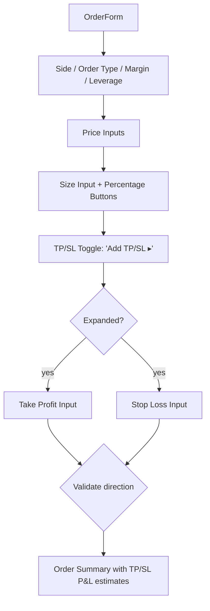

## Problem Statement

The Perps order form lacks Take Profit (TP) and Stop Loss (SL) inputs. On every major perps platform (Hyperliquid, Bybit, Binance Futures), users can set TP and SL prices when placing an order, so protective orders are created automatically alongside the main position.

Without TP/SL on the order form, traders must:
1. Place their main order
2. Wait for it to fill
3. Navigate to their position
4. Manually place a separate stop-loss order
5. Manually place a separate take-profit order

This workflow is risky (position is unprotected between steps 1 and 5) and cumbersome.

## User Story

As a perps trader, I want to set Take Profit and Stop Loss prices when placing my order, so that my position is automatically protected from the moment it opens.

## How It Was Found

Tested the full order placement flow in the Perps section. The form has Market/Limit/Stop-Limit order types, leverage, and size, but no TP/SL fields. This is a standard feature on competing platforms.

## Proposed UX

Add a collapsible "TP / SL" section below the size input (collapsed by default):
- **Take Profit** price input (optional)
- **Stop Loss** price input (optional)
- When TP/SL values are entered, show estimated P&L for each level in the order summary
- TP must be above entry for longs, below for shorts (validate with inline error)
- SL must be below entry for longs, above for shorts (validate with inline error)

The section toggle should be a small link/button: "Add TP/SL ▸" that expands to show the fields.

When collapsed and values are set, show a compact summary like "TP $65,000 / SL $58,000".

## Acceptance Criteria

- [ ] "Add TP/SL" toggle appears below the size input
- [ ] Clicking it reveals Take Profit and Stop Loss price inputs
- [ ] TP/SL inputs accept numeric values and validate direction (TP above entry for long, below for short)
- [ ] Invalid TP/SL shows inline validation error
- [ ] When TP/SL values are set, the order summary shows estimated P&L at each level
- [ ] Order summary displays TP/SL values if set
- [ ] The section can be collapsed back

## Verification

- Open /perps, enter a size, expand TP/SL section
- Verify validation works (try TP below entry for a long)
- Verify estimated P&L calculations are shown

## Out of Scope

- Trailing stop loss
- Multiple TP levels (scaling out)
- Modifying TP/SL on existing positions from the open positions panel

---

## Planning

### Overview

Add a collapsible TP/SL section to the `OrderForm` component in `/perps/page.tsx`. The section includes two optional price inputs (Take Profit and Stop Loss), validation logic, and estimated P&L display in the order summary.

### Research Notes

- The `OrderForm` already calculates `effectivePrice`, `sizeNum`, `leverage`, and `liqPrice`
- TP/SL P&L calculation: `pnl = (tp - entry) × size` for longs, `pnl = (entry - tp) × size` for shorts
- Validation: TP must be above entry for longs (below for shorts), SL is the reverse
- The existing `sanitizeNumericInput` function handles decimal input validation

### Assumptions

- TP/SL are displayed as optional inputs in a collapsible section
- The section starts collapsed to keep the form compact
- State is local to the form (not persisted)

### Architecture Diagram

### One-Week Decision

**YES** — This is a ~2-hour change: add state, collapsible UI, validation, and estimated P&L.

### Implementation Plan

1. Add `tp`, `sl`, and `showTpSl` state variables
2. Add toggle button below size input (or below percentage buttons if 0113 is done)
3. When expanded, show TP and SL price inputs with labels
4. Add validation: for Long, TP > entry and SL < entry; for Short, reverse
5. In the order summary section, add TP P&L and SL P&L rows when values are set
6. Show inline validation errors for invalid TP/SL directions
