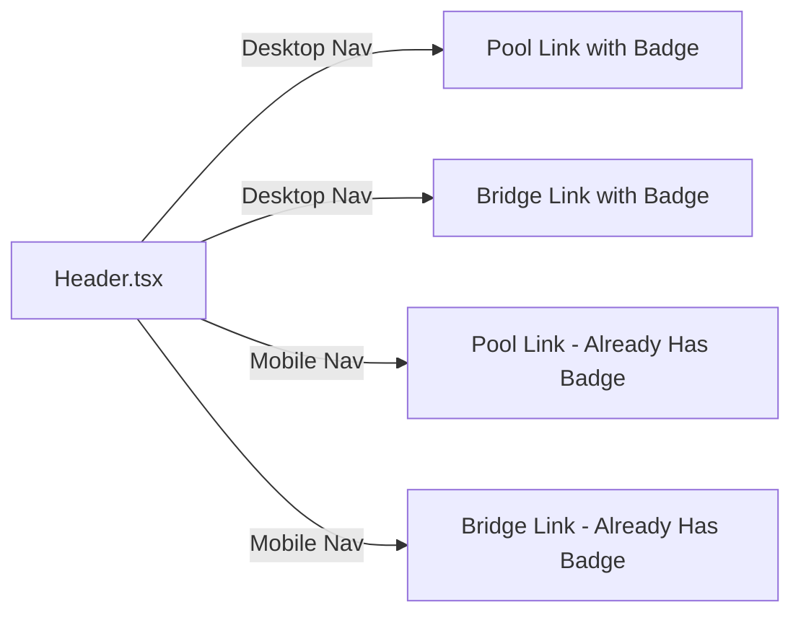

## Problem Statement

On desktop, the Pool and Bridge navigation items look nearly identical to active features. They have a subtle `opacity-60` styling and a tooltip that only appears on hover — but a first-time user won't notice the dimming and will click through to a dead "Coming Soon" page. This creates a bad first impression ("is this app unfinished?").

The mobile menu already has visible "Coming Soon" badges next to Pool and Bridge. The desktop nav needs the same treatment.

## User Story

As a first-time visitor, I want to see at a glance which features are available and which are coming soon, so that I don't click into empty placeholder pages and question the app's readiness.

## How It Was Found

Visual review with agent-browser. Navigated all 7 nav items as a new user. Pool and Bridge nav items look active on desktop but lead to "Coming Soon" placeholder pages. The accessibility tree labels them "Pool Coming Soon" / "Bridge Coming Soon" but this text is not visible — it's only in the hover tooltip.

## Proposed UX

Add a small inline "Soon" badge next to Pool and Bridge on the desktop nav bar, matching the style already used in the mobile menu. The badge should be compact (e.g., a small pill with reduced opacity) so it doesn't clutter the nav but clearly signals these features aren't live yet.

Desktop nav example: `Pool` → `Pool · Soon` or a small pill badge after the text.

Keep the existing hover tooltip as secondary reinforcement.

## Acceptance Criteria

- [ ] Pool and Bridge desktop nav items show a small visible "Soon" or "Coming Soon" indicator without requiring hover
- [ ] The badge styling is subtle but clearly visible (e.g., small text, reduced opacity pill)
- [ ] Mobile menu "Coming Soon" badges remain unchanged
- [ ] Existing hover tooltip on desktop still works
- [ ] No layout shift or overflow from the added badges

## Verification

- Visual check with agent-browser on desktop viewport: Pool and Bridge should have visible badges
- Mobile menu still shows "Coming Soon" badges correctly
- Run test suite to ensure no regressions

## Out of Scope

- Removing Pool/Bridge from the nav entirely
- Changing the "Coming Soon" placeholder pages themselves
- Adding badges to any other nav items

## Planning

### Overview

Add a visible "Soon" badge to the desktop navigation links for Pool and Bridge in `Header.tsx`. The mobile menu already has badges — this brings desktop to parity.

### Research Notes

- File: `frontend/src/components/Header.tsx`
- Desktop nav (lines 55–77): Pool and Bridge have `opacity-60` styling and a hover tooltip (opacity-0 → opacity-100 on group-hover)
- Mobile nav (lines 121–181): Pool and Bridge have visible `` badges with `text-xs text-goodgreen/60 bg-goodgreen/10 px-2 py-0.5 rounded-full`
- The desktop badge should be smaller than the mobile one to fit the horizontal nav layout

### Architecture Diagram

### One-Week Decision

**YES** — This is a ~15 minute change to one file. Add a small badge `` next to "Pool" and "Bridge" in the desktop nav, styled similarly to the mobile badges but more compact.

### Implementation Plan

1. In `Header.tsx`, add a small "Soon" pill badge inline after the "Pool" and "Bridge" text in the desktop nav (lines 58–73)
2. Use a compact style: `text-[10px] text-goodgreen/50 bg-goodgreen/10 px-1.5 py-0.5 rounded-full ml-1`
3. Keep existing hover tooltip and opacity-60 styling
4. Run existing Header tests to verify no regressions
