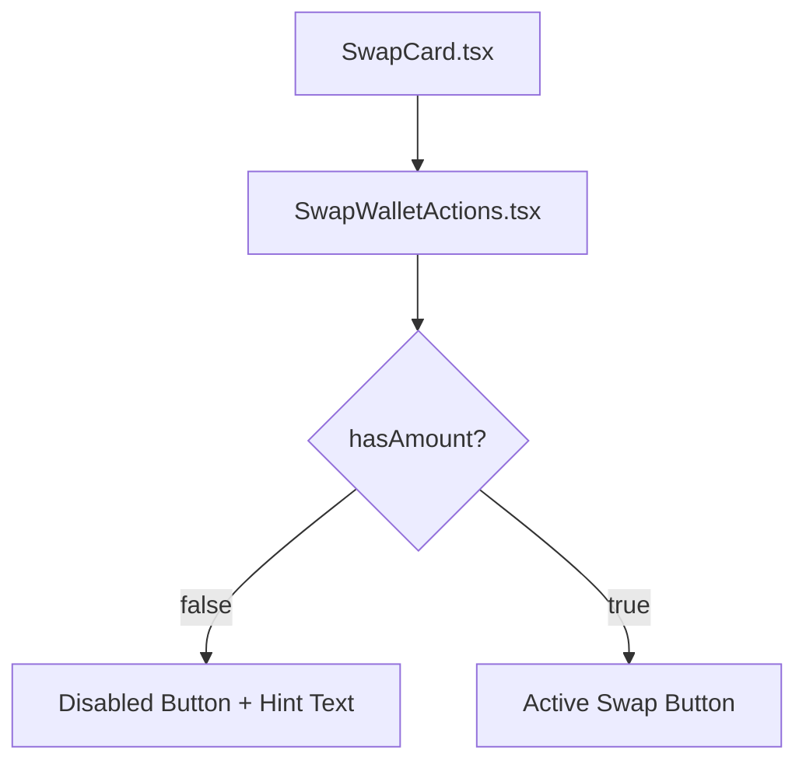

## Problem Statement

When a first-time user lands on the homepage, the swap card shows two empty input fields with a disabled "Enter an Amount" button. There's no guidance about what to do, what the swap does, or why someone should try it. The "You pay" / "You receive" labels are minimal and assume the user already understands token swapping.

For a user who has never used a DEX, the swap card doesn't communicate the value or provide a clear starting point. The disabled button "Enter an Amount" is uninviting — it tells users what's missing but not what they'd gain by interacting.

## User Story

As a first-time visitor who has never used a DEX, I want the swap card to give me a hint about what to try, so that I understand the value proposition and feel encouraged to interact with the form.

## How It Was Found

Fresh-eyes review with agent-browser. Landed on the homepage as a brand-new user. The swap card immediately shows but provides no context for someone unfamiliar with DeFi. The disabled "Enter an Amount" button doesn't motivate action. Competing platforms (Uniswap, 1inch) show contextual hints and suggested actions.

## Proposed UX

Add a small contextual hint below the swap card's input area (or as placeholder text in the input) when the form is in its initial empty state. Something like:

- Input placeholder: "0.0" (current) → keep as-is, but add a subtle hint below the swap card
- Below-card hint (when amount is 0): "Try swapping ETH → G$ — 0.1% of fees fund basic income for 640K+ people"
- The hint should disappear once the user starts typing an amount
- Style it as subtle gray text, not a banner or modal

This reinforces the UBI value proposition at the exact moment the user is deciding whether to engage.

## Acceptance Criteria

- [ ] When the swap card is in its initial state (amount = 0, no interaction), a small hint text is visible below the input fields or above the disabled button
- [ ] The hint includes a concrete example (e.g., "Try swapping ETH → G$") and references the UBI impact
- [ ] The hint disappears or fades when the user enters an amount
- [ ] The hint text is styled subtly (small, gray, not intrusive)
- [ ] No layout shift when the hint appears/disappears

## Verification

- Visual check: hint visible on fresh page load
- Enter an amount: hint should disappear
- Clear the amount: hint should reappear
- Run test suite to ensure no regressions

## Out of Scope

- Adding a full onboarding wizard or tutorial
- Changing the swap card layout or styling
- Adding wallet connection prompts

## Planning

### Overview

Add a subtle hint text below the swap card inputs when the form is in its empty/initial state. The hint gives first-time users a concrete suggestion and reinforces the UBI value prop.

### Research Notes

- Swap card: `frontend/src/components/SwapCard.tsx` (main card component)
- Swap button: `frontend/src/components/SwapWalletActions.tsx` (handles the "Enter an Amount" disabled button)
- The hint should appear when `hasAmount` is false (amount is 0 or empty)
- Should fade out smoothly when user starts typing

### Architecture Diagram

### One-Week Decision

**YES** — Small change to add a `
` element below the disabled button in `SwapWalletActions.tsx`, conditionally rendered when `!hasAmount`.

### Implementation Plan

1. In `SwapWalletActions.tsx`, add a hint text element below the disabled "Enter an Amount" button
2. Text: "Try swapping ETH → G$ — 0.1% of fees fund basic income for 640K+ people"
3. Style: `text-xs text-gray-500 text-center mt-3` — subtle and non-intrusive
4. Only show when `!hasAmount`
5. Run tests to verify no regressions
