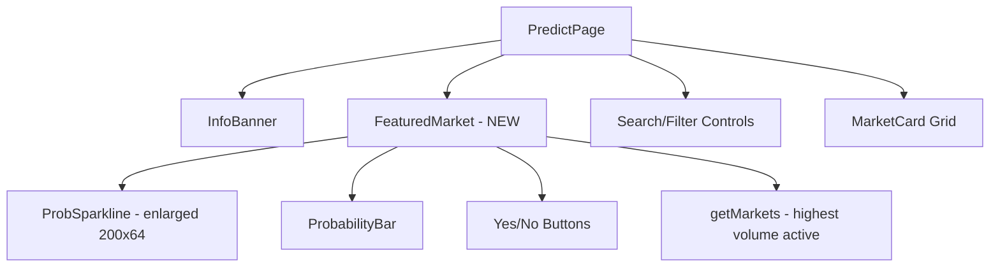

## Problem Statement

Our Predict page opens with a flat grid of equal-sized market cards. Polymarket, the leading prediction market, immediately showcases a featured/trending market at the top of the page in a large hero card with an interactive price chart, outcome probabilities displayed prominently, and volume/liquidity data. This hero section instantly draws users in and communicates "this platform is active and interesting."

Our page goes straight from the header into search/filter controls and then a uniform card grid. There's no visual hierarchy that says "this market is hot right now." Users scanning the page don't get the immediate engagement that Polymarket delivers.

## User Story

As a prediction market visitor, I want to see the highest-volume or trending market showcased prominently at the top of the page with a larger chart and more detail, so that I'm immediately drawn into the platform's most exciting content.

## How It Was Found

Side-by-side comparison of our Predict page (`/predict`) against Polymarket homepage. Polymarket's hero section shows: a large market title (e.g., "2026 NCAA Tournament Winner"), outcome probabilities with percentages, a multi-line price history chart showing dollar-level price movements, user comments/activity feed, and "LIVE" badges. Our page shows only a flat grid with no hero emphasis.

## Proposed UX

Add a "Featured Market" hero section between the page header/info banner and the search/filter controls:

- **Layout**: Full-width card spanning the page, taller than regular cards (~180-200px)
- **Left side**: Market question in larger text (text-lg font-semibold), category badge, days left, volume and liquidity
- **Right side**: A larger probability sparkline chart (200×80px instead of the tiny 72×24px) with percentage and Yes/No buttons
- **Selection**: Automatically pick the highest-volume active market, or the most recently created one
- **Style**: Same dark card style as existing cards but with a subtle gradient border (goodgreen/20 to transparent) to visually distinguish it
- **Dismiss**: Not dismissable — always shows the top market

## Acceptance Criteria

- [ ] A "Featured Market" or "Trending" hero card appears at the top of the predict page, above the search/filter controls
- [ ] The hero card displays the highest-volume active market
- [ ] The hero card shows: market question (larger text), category badge, time remaining, probability percentage, a larger sparkline chart, Yes/No trade buttons, volume, and liquidity
- [ ] The hero card is visually distinct from regular market cards (larger, more prominent)
- [ ] Clicking the hero card navigates to the market detail page
- [ ] The hero card is responsive — stacks vertically on mobile
- [ ] No layout shift or visual regression to the existing card grid below

## Verification

- Visual check: hero card is visible and visually prominent
- Click hero card: navigates to correct market detail page
- Resize to mobile: layout stacks cleanly
- Run test suite to ensure no regressions

## Out of Scope

- User comments or social activity feed
- Multi-outcome markets (our markets are all binary Yes/No)
- Interactive chart (simple sparkline is sufficient)
- Manual curation of featured market (auto-select by volume)

## Planning

### Overview

Add a FeaturedMarket component to the Predict page that renders a wide hero card above the search/filter controls. It auto-selects the highest-volume active market and renders a larger version of the existing MarketCard with a bigger sparkline chart.

### Research Notes

- Predict page: `frontend/src/app/predict/page.tsx`
- Market data: `frontend/src/lib/predictData.ts` — `getMarkets()` returns array, already sorted; `generateProbabilityHistory()` creates sparkline data
- Existing `ProbSparkline` component renders at 72×24px — we need a larger version
- Existing `MarketCard` has all building blocks (ProbabilityBar, Yes/No buttons, Vol/Liquidity)
- `ProbSparkline` is defined inline in `predict/page.tsx` — can be parameterized for larger size

### Architecture Diagram

### One-Week Decision

**YES** — Single component addition to `predict/page.tsx`. Uses existing data functions and UI patterns. ~2 hours of work.

### Implementation Plan

1. Create a `FeaturedMarket` component in `frontend/src/app/predict/page.tsx`
2. Select the highest-volume active market from the existing `getMarkets()` data
3. Render a full-width card with: market question (text-lg), category badge, time remaining, larger sparkline (200×64), probability %, Yes/No buttons, volume + liquidity
4. Use a horizontal layout: left side for text content, right side for chart and buttons
5. Place it between InfoBanner and the search/filter controls
6. Mobile: stack vertically
7. Write tests and verify
