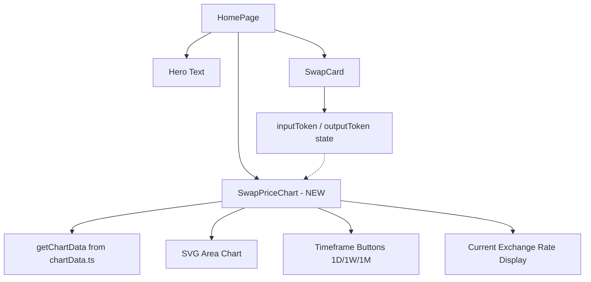

## Problem Statement

Our Swap page shows only the swap card widget — two token inputs, a swap direction button, and the action button. There is zero market context. Users see "ETH → G$" but have no idea what the current exchange rate looks like, whether the price has gone up or down recently, or if now is a good time to swap.

Every major DEX — Uniswap, 1inch, Jupiter, PancakeSwap — displays a price chart showing the selected pair's price history near the swap widget. This gives users critical market context and confidence before executing a trade.

## User Story

As a DeFi trader using GoodSwap, I want to see a price chart for the selected token pair above the swap card, so that I can understand the price trend and make informed trading decisions.

## How It Was Found

Competitor comparison: attempted to load Uniswap (app.uniswap.org) — had connectivity issues, but from known UX patterns, all major DEXes show a price chart. Our swap page at `/swap` shows only the swap card with hero text above it, no market data visualization at all. Users switching from Uniswap/1inch would immediately notice the missing chart.

## Proposed UX

Add a price chart between the hero subtitle and the swap card:

- **Chart**: A lightweight area chart (using existing `lightweight-charts` dependency or a simulated sparkline chart) showing the selected pair's price history
- **Timeframes**: Toggle between 1D, 1W, 1M, 3M, 1Y (like the perps page already does)
- **Current price**: Show the current exchange rate prominently above the chart (e.g., "1 ETH = 298,450 G$")
- **Price change**: Show 24h change percentage next to the current price
- **Container**: Semi-transparent dark card, matching the existing swap card width (~max-w-md)
- **Position**: Below the UBI impact text, above the swap card
- **Data**: Use simulated/generated chart data (consistent with how explore sparklines work)

## Acceptance Criteria

- [ ] A price chart is displayed above the swap card on both the homepage (`/`) and the swap page (`/swap`)
- [ ] The chart shows price history for the currently selected token pair
- [ ] The current exchange rate is displayed prominently above the chart (e.g., "1 ETH = 298,450 G$")
- [ ] 24h price change is shown with green/red color coding
- [ ] Timeframe buttons (1D, 1W, 1M) allow switching the chart period
- [ ] The chart updates when the user changes the input or output token in the swap card
- [ ] The chart is responsive and doesn't exceed the swap card width
- [ ] No layout shift or visual regression to the existing swap card

## Verification

- Visual check: chart appears above swap card with price data
- Change tokens in swap card: chart updates to reflect new pair
- Toggle timeframes: chart data changes
- Mobile: chart stacks cleanly above swap card
- Run test suite

## Out of Scope

- Real-time WebSocket price feeds (simulated data is fine)
- Candlestick charts (simple area/line chart is sufficient)
- Chart drawing tools or technical analysis
- Order book or depth chart

## Planning

### Overview

Add a SwapPriceChart component that renders an area chart showing the selected token pair's price history above the swap card. The chart uses the existing `chartData.ts` infrastructure (`getChartData`) for generated data and the existing `Sparkline` component pattern (SVG-based area chart).

### Research Notes

- Homepage: `frontend/src/app/page.tsx` — SwapCard placed in a `max-w-[460px]` container
- SwapCard: `frontend/src/components/SwapCard.tsx` — tracks `inputToken` and `outputToken` state
- Chart data: `frontend/src/lib/chartData.ts` — `getChartData(symbol, timeframe, basePrice)` returns OHLC data
- Market data: `frontend/src/lib/marketData.ts` — provides `getTokenMarketData()` with prices and changes
- Perps page already uses `lightweight-charts` for OHLC — but for swap we want a simpler area chart (SVG-based, not the heavy library)
- The `/swap` route currently just redirects to `/` — so the chart only needs to be on the homepage
- SwapCard uses `inputToken`/`outputToken` from its internal state — need to lift or expose selected tokens

### Architecture Diagram

### One-Week Decision

**YES** — Self-contained SVG area chart component. Reuses existing `getChartData` for data generation. The main challenge is communicating selected tokens from SwapCard to the chart — can be done via shared state or by reading the default tokens. ~3-4 hours of work.

### Implementation Plan

1. Create `SwapPriceChart` component in `frontend/src/components/SwapPriceChart.tsx`
2. Accept `inputToken` and `outputToken` props (symbol strings)
3. Use `getChartData` from `chartData.ts` to get price data for the input token
4. Render an SVG area chart (similar pattern to existing Sparkline but larger, ~400×120px, with filled area)
5. Add timeframe buttons (1D, 1W, 1M) styled like the perps page timeframe selector
6. Show current exchange rate text above the chart (e.g., "1 ETH = 298,450 G$")
7. Show 24h change percentage with color coding
8. Place in `page.tsx` between hero text and swap card, within the same max-width container
9. Use default tokens (ETH/G$) since SwapCard tokens aren't currently exposed as props
10. Write tests and verify
