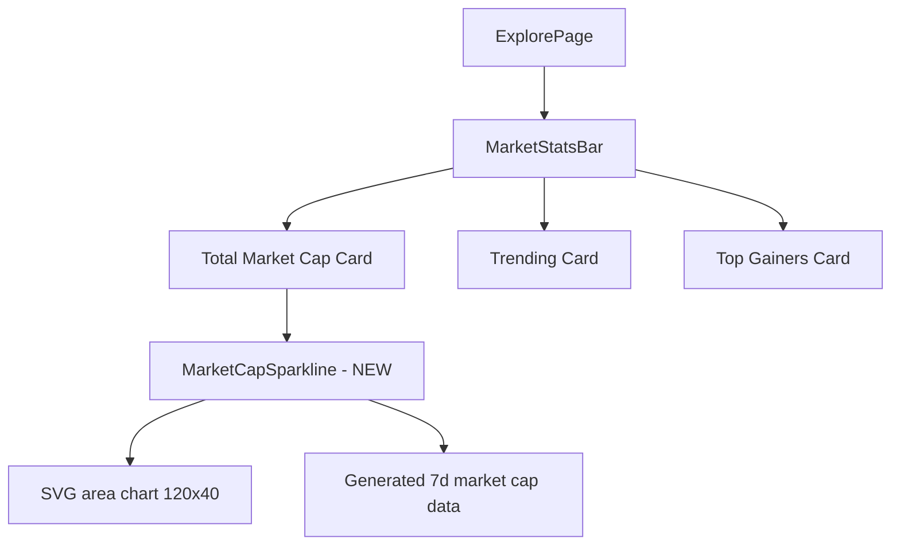

## Problem Statement

Our Explore page's market stats bar shows three cards: Total Market Cap, Trending, and Top Gainers. The Total Market Cap card shows a dollar amount and a 24h change percentage as plain text. CoinGecko's equivalent section shows sparkline charts inside the summary cards — a green/red area chart for market cap trend and a separate one for 24h trading volume, making the data visually engaging and instantly communicating whether the market is up or down.

Our Total Market Cap card is text-only and feels static. Adding a small sparkline chart would immediately make the stats bar richer and more informative.

## User Story

As an Explore page visitor, I want to see a small sparkline chart in the Total Market Cap summary card, so that I can instantly visualize the market trend without reading just numbers.

## How It Was Found

Side-by-side comparison of our Explore page (`/explore`) against CoinGecko homepage. CoinGecko shows sparkline charts inside its market cap and volume summary cards. Our Total Market Cap card at the top of the Explore page shows "$565.38B" and "▲ 1.56% (24h)" as text only — no visual chart. The Trending and Top Gainers cards show individual tokens but also lack visual sparklines at the card level.

## Proposed UX

Add a small area sparkline chart (approximately 120×40px) to the Total Market Cap card:

- **Position**: Right side of the card, next to the text content
- **Chart**: A subtle area chart showing 7-day market cap history
- **Color**: Green fill when positive (24h change > 0), red fill when negative
- **Data**: Generated/simulated 7-day market cap history data points (consistent with existing sparkline approach)
- **Style**: Low opacity fill (10-15%) with a thin stroke line, matching the existing dark card aesthetic

## Acceptance Criteria

- [ ] The Total Market Cap summary card on the Explore page displays a small sparkline area chart alongside the dollar amount and change percentage
- [ ] The sparkline shows approximately 7 days of market cap history
- [ ] The chart color is green when 24h change is positive, red when negative
- [ ] The chart doesn't cause layout shift or break the existing card layout
- [ ] The chart is responsive — hides or shrinks gracefully on mobile
- [ ] Existing Trending and Top Gainers cards are not affected

## Verification

- Visual check: sparkline chart visible in Total Market Cap card
- Responsive: check on mobile width, chart scales or hides
- Run test suite to ensure no regressions

## Out of Scope

- Adding sparklines to Trending or Top Gainers cards
- Real-time data feeds
- Interactive/hover chart features
- Volume chart (just market cap for now)

## Planning

### Overview

Add a small area sparkline chart to the Total Market Cap summary card on the Explore page. The chart uses a generated 7-day data series and renders as an SVG area fill alongside the existing text.

### Research Notes

- Explore page: `frontend/src/app/explore/page.tsx` — `MarketStatsBar` component renders the 3 summary cards
- Total Market Cap card: shows `formatMarketCap(stats.totalMarketCap)` and `weightedChange` percentage
- Existing Sparkline: `frontend/src/components/Sparkline.tsx` — renders a polyline SVG, no fill
- For an area chart, need to add a filled polygon below the line
- Market data: `frontend/src/lib/marketData.ts` — has `sparkline7d` arrays on individual tokens; can aggregate or generate a total market cap sparkline
- Card uses `grid grid-cols-1 md:grid-cols-3` layout — need to fit chart within card without breaking

### Architecture Diagram

### One-Week Decision

**YES** — Tiny feature: add a small SVG area chart component inside the existing card. Generate 7-day market cap history data. ~1-2 hours.

### Implementation Plan

1. Add a `MarketCapSparkline` component inline in `explore/page.tsx` (or as a small helper)
2. Generate 7-day market cap history data points in the `MarketStatsBar` component using a simple seeded random walk from the total market cap
3. Render as an SVG area chart (120×40px) — polyline for the stroke plus a polygon for the fill with low opacity
4. Color: green when `weightedChange >= 0`, red when negative
5. Position it on the right side of the Total Market Cap card using flex layout
6. On mobile (small screens), optionally hide or reduce the chart size
7. Write tests and verify
